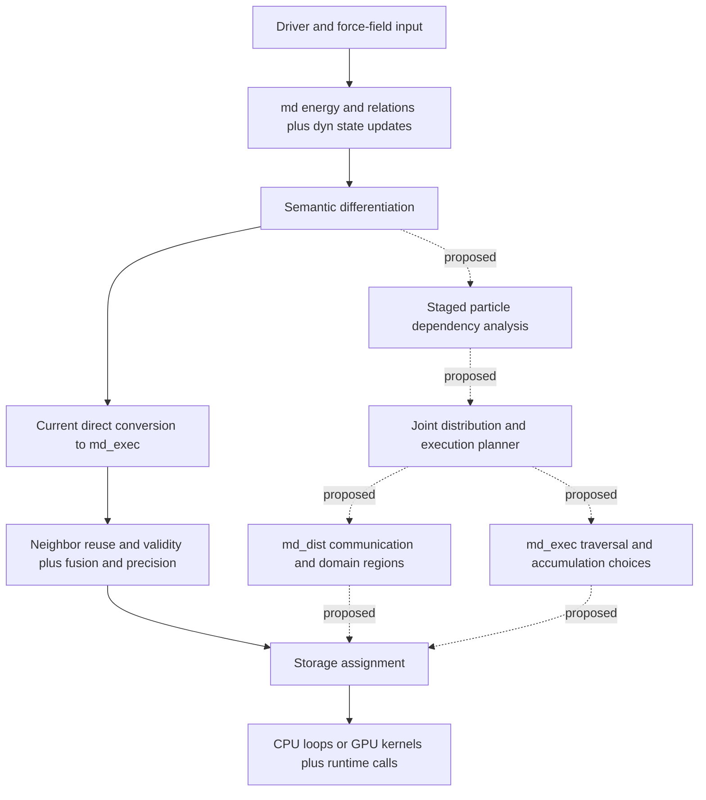

# MDIR Future Architecture Plan: Saunders, Cornel, and P4IRS

Initial architecture review: October 1, 2026. Updated October 2, 2026 after reading William Robert Saunders's doctoral thesis. Sources: the three supplied theses/papers, the repository, and primary documentation for the model interfaces discussed below. The implementation survey records the October 1 baseline; the Saunders additions refine the future plan rather than claim a new implementation audit. This document distinguishes implemented behavior, documented plans, and recommendations. It does not reproduce benchmark results or execute the test suite.

MDIR's separation of potential semantics, dynamics, distribution, and traversal is a sound basis for combining classical force fields with machine-learned interatomic potentials (MLIPs). The strongest research direction is to preserve spatial and topological dependencies through differentiation, then use those dependencies to select communication and traversal together. The repository already provides useful foundations: semantic differentiation, explicit relations, exchange contracts, neighbor validity, storage assignment, and CPU/GPU lowering. The staged dependency interface and distributed planner that would connect them remain proposals.

Saunders establishes precedents for access-directed field-halo reuse, multistage structural analysis, collective Ewald evaluation, and hierarchical distributed electrostatics. Cornel establishes a substantial precedent for particle IRs with automatic communication placement. P4IRS establishes a substantial precedent for generating different neighbor algorithms and parallel implementations from one particle computation. Current MLIP engines already demonstrate model-dependent distributed execution. Consequently, separating semantics from execution, generating CPU/GPU code, or communicating only fields that kernels read would be insufficient contribution claims by themselves. The proposed combination of staged dependencies, derivative-aware communication, and joint planning is worth pursuing, but this review cannot establish its novelty across the literature.

The recommended extension has two complementary parts: an atomistic/equivariant computation IR that preserves information needed for optimization, and compatibility tiers that accept existing model artifacts without requiring a complete importer. Use community model interfaces where possible. MDIR's role is to compile potential semantics into a verified execution plan, rather than to require one implementation or packaging format for every potential.

Use metatomic as the reference MLIP interoperability interface while keeping its adapter optional and MDIR's compiler types, dependency graph, and ABI versions independent. Retain the planned OpenMM-like scientific API above the compiler: users compose systems, potentials, and dynamics; the compiler derives and realizes their dependencies. These are complementary public boundaries.

Treat the batch/HPC CLI as an equally important entry point to that scientific model. Staged compilation, inspectable run artifacts, and restart independent of rank-local layouts should constrain the design early, even while their implementation follows the dependency and distributed-correctness milestones.

The Saunders reading strengthens five planning requirements: distinguish exact semantic support from candidate traversal; describe reductions and data distribution explicitly; support versioned analysis intermediates as well as energies; admit hierarchical entity/ownership maps; and make approximation accuracy a constraint on legal plans. It also argues for bounded tuning and explicit host-access costs. The detailed evidence and proposed changes appear in [the Saunders review](#architecture-lessons-from-saunders).

## Evidence and corrections to the starting assessment

The starting assessment is directionally useful, but four corrections change the architectural comparison.

| Starting point | Finding from the sources | Implication |
|---|---|---|
| MDIR currently implements M0 | The architecture status table describes M0, but the checkout also contains bonded tuple operations, PME, constraints, thermostat/barostat support, and an optional GPU neighbor-group path. | Use source-level evidence for the baseline; milestone labels have become less reliable. |
| Cornel analyzes whether particle fields are stale | Cornel tracks domain ownership, each ghost field, and each neighbor list, using both definite and potential staleness and liveness. | MDIR must go beyond a rich existing correctness analysis, rather than beyond a single dirty flag. |
| P4IRS mainly supplies code generation | Its communication section also selects fields using neighbor accesses and whether properties change across time steps. | Dependency-informed field selection is already prior art. |
| P4IRS has no evident public repository | The supplied paper explicitly describes the compiler as open source and provides `https://i10git.cs.fau.de/software/pairs` in note 2. | Cite that location. Its current availability and maintenance status are unresolved; a failed fetch does not establish either. |

The publisher records P4IRS as first published online on December 8, 2025. The supplied PDF is the 2026 issue version, volume 40(5), pages 621–642. These are different publication events, not conflicting dates. [Publisher record](https://journals.sagepub.com/doi/10.1177/10943420251405928). The repository link and open-source description appear in the local paper on pages 626 and 641. [P4IRS paper](https://journals.sagepub.com/doi/10.1177/10943420251405928).

## The architecture that exists today

### Semantic and execution layers

The implemented semantic core uses particle sets, fields, neighborhoods, and relations. `md.potential` represents energy, while `md.evaluate` requests quantities such as forces and virial. `md.sum_relation` and `md.sum_tuples` distinguish spatial pairs from explicit tuples. `dyn` provides reusable dynamics programs and basic state updates; the driver builds more complete simulation protocols around these primitives. The semantic differentiation pass produces domain-level operations before traversal and storage are lowered. [Semantic operation definitions](../include/mdir/Dialect/MD/MDOps.td), [dynamics definitions](../include/mdir/Dialect/Dyn/DynOps.td), [differentiation implementation](../lib/Dialect/MD/Transforms/Differentiate.cpp).

`md_exec` realizes computations as particle, pair, and tuple loops. It makes destinations, reductions, cutoff tests, exchange behavior, and traversal policies visible. Separate transformations manage neighbor reuse, validity, fusion, precision, and storage. CPU and GPU conversions then replace these operations with upstream MLIR constructs. The driver assembles this pipeline from control-file options. [Execution definitions](../include/mdir/Dialect/MDExec/MDExecOps.td), [driver pipeline](../tools/mdir/Run.cpp), [CPU conversion](../lib/Conversion/MDExecToLoops/MDExecToLoops.cpp), [GPU conversion](../lib/Conversion/MDExecToGPU/MDExecToGPU.cpp).

This is already a useful compiler architecture. A physical neighbor representation is chosen below the energy definition, and a derived kernel's exchange contract can govern whether computing a pair once is legal. That creates an explicit connection between semantic facts and execution choices.

### Implemented behavior versus proposed behavior

| Area | Evidence in the checkout | Status and limit |
|---|---|---|
| Energy semantics and differentiation | `md` definitions and `Differentiate.cpp`; derivative tests for pairs and tuples | Implemented for supported scalar expressions and coordinates. This is not a general reverse-mode engine for arbitrary particle graphs. |
| Traversal and accumulation | `md_exec.particle_for`, `pair_for`, `tuple_for`; exchange and traversal attributes | Implemented. The matrix baseline uses directed pairs with owner-only writes. |
| Alternative GPU neighbors | `ChooseNeighbors.cpp`, groups template, runtime and tests | An optional groups path exists. The pass selects unique traversal and atomic accumulation only when exchange contracts permit it. The design labels G1 done and G2 under way. |
| Neighbor reuse and validity | `ReuseNeighbors.cpp`, `ExposeValidity.cpp`, `RebuildAtInterval.cpp` | Implemented. The default checks validity; a fixed rebuild interval is an explicit alternative. |
| Single-node PME | `md.reciprocal`, `md_exec.reciprocal`, CPU/GPU templates and FFT runtime | Implemented. Reciprocal forces and virial are supplied by a specialized implementation; the compiler does not differentiate through the FFT pipeline. |
| GPU overlap | `AssignStreams.cpp`, buffer alias/effect analysis, `md_exec.join`, CUDA events | A specific second-stream mechanism exists for reciprocal work. It is not a general distributed event scheduler. |
| Runtime event type | `!mdrt.event` in `MDRTTypes.td` | The type is declared. General event-producing communication operations and their planned scheduling path are not implemented. |
| Distribution | No `md_dist` dialect or distributed planning implementation in the reviewed compiler sources | Proposed. MPI, NVSHMEM, and multiple-GPU transports are architecture goals. |
| Staged dependency interface | Described in architecture Section 6; absent from compiler sources | Proposed. There is no implemented `ParticleDependencyInterface` contract or stage extractor. |
| Joint planner | Architecture Sections 7 and 8 | Proposed. Current pass/driver options select strategies; they do not constitute a cost-based joint planner. |
| MLIP integration | `mlff` and `md.external_potential` appear in the architecture proposal, but not in implemented operation definitions | Proposed, including the opaque escape hatch. |
| Ensemble dialect | Architecture proposal | Proposed. Existing thermostat/barostat functionality does not imply that an `ensemble` dialect exists. |

Evidence: [architecture status and proposals](architecture.md), [neighbor selection](../lib/Dialect/MDExec/Transforms/ChooseNeighbors.cpp), [groups status](groups-m1.md), [validity analysis](../lib/Dialect/MDExec/Transforms/ExposeValidity.cpp), [PME design](pme-m1.md), [stream assignment](../lib/Dialect/MDExec/Transforms/AssignStreams.cpp), [independence analysis](../lib/Dialect/MDExec/Independence.cpp), [runtime types](../include/mdir/Dialect/MDRT/MDRTTypes.td).

The proposed tile representation should not be presented as the current implementation: its design document marks it superseded by the groups design. Likewise, the current groups path should not be described as a completed general cluster-list optimizer. [Tile status](tiles-m1.md), [groups design](groups-m1.md).

### Current and proposed compilation paths



Solid edges describe the implemented path at an architectural level. Dashed edges describe the planned extension; the diagram does not prescribe exact pass nesting. The important boundary is that distribution and traversal derive from a shared plan before storage assignment removes field-value semantics. [Current pipeline](../tools/mdir/Run.cpp), [proposed pipeline](architecture.md#2-two-structures-a-graph-and-a-pipeline).

## Cornel's architecture and its relevance

### Particle semantics and distributed specialization

Cornel's thesis develops a target-agnostic `particles` dialect and specializes it to `particles_dist`, which introduces distributed-memory and OpenFPM-specific information. The implementation predominantly uses xDSL, then lowers to upstream MLIR/LLVM infrastructure. Calling this an MLIR workflow is accurate; describing it as exclusively a C++ MLIR dialect implementation would obscure how it was built. [Cornel, Sections 3.4 and 4.1, printed pages 22–28](https://cfaed.tu-dresden.de/publications?pubId=3851).

The abstract `particles_base` definitions supply a shared structure. The principal operations are `loop`, `foreach`, and `for_all_neighbors`, with particle property access and per-particle reductions. `particles_dist.for_all_neighbors` adds neighbor representation information and pre-/post-interaction regions that enable fusion with particle updates. Companion dialects represent `cell_list` and `local_domain` traversal. This architecture already separates target-independent particle computations from distributed specialization and physical neighborhoods. [Cornel, Sections 4.3–4.5 and 6.3, printed pages 32–45 and 71–76](https://cfaed.tu-dresden.de/publications?pubId=3851).

One difference is where execution choices enter. Cornel's specialization obtains the neighbor-list kind and maximum distance from extrinsic attributes on the original particle operation. MDIR proposes to retain semantic support while a planner supplies the physical choice. That is a potentially meaningful difference if planning actually derives choices and verifies their legality; replacing input attributes with another configuration object would provide little additional contribution.

### Modification graphs and state semantics

Cornel explicitly describes particle-set SSA as “fake value semantics”: operations consume a set reference, modify underlying memory, and produce a new reference to that memory. Previous references cannot be reused. A restricted single-source, single-sink modification graph makes updates analyzable and aligns graph branches with control-flow branches. These restrictions are an essential part of the design, not incidental syntax. [Cornel, Sections 4.2.1–4.2.2, printed pages 28–32](https://cfaed.tu-dresden.de/publications?pubId=3851).

MDIR instead specifies individual field values and a later storage-assignment boundary. Its architecture allows an old value to remain live, for example while a proposed configuration is evaluated. The implemented storage pass must decide whether in-place reuse preserves those uses. This gives MDIR a more explicit basis for expressing independent computations and preserved configurations, but merely using SSA does not prove that buffer reuse or overlap is safe. [MDIR state and storage semantics](architecture.md#41-state), [storage assignment](../lib/Dialect/MDExec/Transforms/AssignStorage.cpp).

The existing storage-form independence analysis reinforces that distinction: it checks effects, possible aliases, and use dependencies conservatively before placing work on a second stream. Semantic independence must survive physical storage assignment. [Independence contract](../include/mdir/Dialect/MDExec/Independence.h), [implementation](../lib/Dialect/MDExec/Independence.cpp).

### What communication placement actually analyzes

Cornel tracks three families of staleness state: `map`, `ghost(field)`, and `neighbor_list(index)`. Potential staleness joins paths with union; definite staleness joins paths with intersection. Liveness identifies structures and ghost-field sets needed by later consumers and across the time-step back edge. Runtime flags support cases where static analysis cannot determine whether an update is necessary. [Cornel, Sections 5.2.1–5.2.3, printed pages 50–57](https://cfaed.tu-dresden.de/publications?pubId=3851).

This analysis is richer than asking whether a field changed. It also accounts for the relationship between ownership, ghost membership, and neighborhood structures, as well as initialization versus steady-state iterations. External calls can declare freshness requirements, updates, and invalidations, or use runtime flags. Unknown calls receive conservative treatment.

There is an important distinction between **pass insertion order** and **runtime execution order**:

| Order | Cornel's sequence | Reason |
|---|---|---|
| Placement passes | Neighbor-list updates → ghost retrieval → mapping | Each pass exposes prerequisites that the following pass must satisfy. |
| Execution when all three are needed | Mapping → ghost retrieval → neighbor-list update → dependent computation | Ownership must be current before selecting ghosts; ghost positions must be available before rebuilding neighborhoods. |

[Cornel, Sections 5.2.2 and 5.2.4–5.2.7, printed pages 53–61](https://cfaed.tu-dresden.de/publications?pubId=3851).

Ghost retrieval has an OpenFPM-specific complication: fetching selected fields deletes buffered ghost values for other fields. The placement algorithm therefore bundles live field sets. Its `balanced` and `optimistic` strategies use definite and potential liveness, respectively. Visiting order can still produce redundant placements, so `maybe_ghost_get` and runtime flags compensate. This is an optimization attempt as well as a correctness transformation, although it is not the joint structural/numeric planner proposed for MDIR. [Cornel, Section 5.2.6, printed pages 59–61](https://cfaed.tu-dresden.de/publications?pubId=3851).

### Limits of the demonstrated result

Cornel's reviewed implementation uses cell lists and local-domain traversal; Verlet support is an extension direction. Symmetric interactions and ghost-put functionality are also future work in the communication discussion. The thesis does not demonstrate differentiated staged MLIP execution with reverse communication. Its benchmark evaluation uses a single machine, with CPU process-count experiments and single-GPU experiments, rather than a multinode HPC evaluation. OpenMP compatibility remains a stated limitation. [Cornel, Sections 3.2.2, 5.2.2, 9.1–9.3, and 10.3](https://cfaed.tu-dresden.de/publications?pubId=3851).

For the initial CPU benchmark, the MLIR/Clang variant took approximately 0.5%–2.5% longer than the GCC C++ reference. GPU performance deteriorated substantially relative to the reference during a run. The author attributes the GPU behavior provisionally to generated control flow and runtime-based iterator integration, and explicitly treats the explanation as a hypothesis. Fusion worsened CPU performance and improved the measured GPU case, with unresolved causes. These results support a lesson about preserving visibility into hot traversal code and measuring fusion; they do not establish that MLIR guarantees either speed or a particular fusion benefit. [Cornel, Sections 9.2–9.5, printed pages 114–122](https://cfaed.tu-dresden.de/publications?pubId=3851).

## P4IRS's architecture and its relevance

### Front end, IR, and generated code

P4IRS describes particle computations as Python methods, maps them into its own particle-oriented AST, and constructs internal routines directly in that representation. High-level nodes such as `ParticleInteraction`, `ParticleFor`, and `BuildNeighborLists` survive until domain-specific lowering selects an implementation. The paper explicitly presents an informal AST rather than a formally specified IR. Generated C++/CUDA is compiled with conventional back-end compilers and linked with a runtime. [P4IRS, pages 626–630, Figures 2–4](https://journals.sagepub.com/doi/10.1177/10943420251405928).

The user supplies an optimization schedule, including Linked Cells versus Verlet Lists, rebuild frequency, and half versus full neighbor lists. `apply` identifies particle-property reductions and supports half-list generation. The paper says methods with more particle parameters can describe many-body computations, but its evaluation centers on LJ and a DEM contact model. It would be inaccurate to conclude that P4IRS cannot express many-body kernels; equally, this statement does not demonstrate an EAM or message-passing communication compiler.

P4IRS also generates neighborhood construction routines, manages array growth, and uses runtime coherence bitmasks for host/device data. Those bitmasks concern storage coherence, which is distinct from distributed ghost freshness. Its runtime metadata makes generic external services possible, while hot generated code accesses specialized structures directly. [P4IRS, pages 628–631](https://journals.sagepub.com/doi/10.1177/10943420251405928).

### Communication and physical algorithms

P4IRS divides distributed communication into `borders`, `synchronize`, and `exchange`. `borders` identifies halo particles and sends nonvolatile properties read from neighbors. `synchronize` sends those required properties that also change across time steps. `exchange` migrates particles with their nonvolatile properties and contact history. A C++ domain-partitioner interface supports alternative decomposition schemes, including waLBerla integration. [P4IRS, page 632, Domain partitioning and communication](https://journals.sagepub.com/doi/10.1177/10943420251405928).

MDIR therefore cannot claim kernel-derived communication field selection as a new feature. A narrower distinction would be planning **between semantic dependency stages**, including forward and derivative stages, rather than selecting one simulation-wide set of changing neighbor properties. That distinction needs an implemented example and careful comparison with the actual P4IRS implementation.

P4IRS also exposes useful physical choices: Linked Cells, Verlet Lists, half/full lists, shape partitioning, separate kernels for shape combinations, and neighbor lists per cell. The last example is particularly relevant to MDIR: reducing force-loop time can fail to improve total time when an added list-build kernel costs more than it saves. Cluster Pair generation and long-range interactions are future work in the supplied paper. [P4IRS, pages 631–632, 637–641](https://journals.sagepub.com/doi/10.1177/10943420251405928).

### What its performance evaluation establishes

The paper evaluates generated LJ code against MD-Bench and generated DEM code against MESA-PD. It reports weak-scaling experiments through 64 CPU nodes and 128 GPU nodes, corresponding to 512 A100 GPUs. That is stronger distributed performance evidence than the current MDIR implementation supplies. However, the LJ case is a homogeneous FCC system run for 200 steps with lists rebuilt every 20 steps. This does not validate arbitrary inhomogeneous systems, exact displacement-based validity, long-range methods, or staged MLIPs. The authors also discuss less favorable scaling in the DEM case. [P4IRS, pages 633–640, Figures 7–13](https://journals.sagepub.com/doi/10.1177/10943420251405928).

The useful lesson is methodological: compare generated variants against strong implementations, measure neighborhood construction and communication alongside the force kernel, and evaluate different workloads. The paper's throughput values cannot be directly compared with MDIR's repository measurements because hardware, precision, systems, and execution policies differ.

## Architecture lessons from Saunders

William Robert Saunders, *Development of a Performance-Portable Framework for Atomistic Simulations*, University of Bath, December 2018; the supplied portal cover records a 2019 award. The local copy has 197 PDF pages. References below use printed thesis pages. Chapters 2–3 develop the PPMD abstraction and code generation; Chapters 4–5 develop electrostatic algorithms and implementations; Chapter 6 identifies limitations and future work. This review reads the thesis directly and extends the narrower PPMD paper analysis. See [source details](#saunders-thesis-source).

### Candidate traversal is not the semantic relation

Definition 2.6 guarantees that a local pair loop includes pairs within its cutoff but permits additional, more distant pairs. The kernel performs the actual distance test. Chapter 3 makes this distinction concrete through cell traversal and buffered neighbor lists. Thus the abstraction promises coverage, not that every enumerated edge is an interaction. (Saunders, Sections 2.2 and 3.1.5, pp. 35–37 and 59–65.)

**MDIR consequence:** distinguish the exact relation requested by a computation, the candidate structure used to enumerate it, and the predicate/certificate establishing complete coverage. A skin changes candidate construction, not the physical cutoff. Every realization must apply the semantic predicate before contributing; this matters for neighbor counts, angular features, and learned messages as much as for forces. Fusion may share candidates while retaining different per-term cutoffs and exclusions. An external neighbor contract must state whether the supplied list is exact or overinclusive and which side applies the final predicate.

This prevents a false unification of FMM near-field interactions with radius-local forces. Saunders's FMM near field covers the containing cube and its 26 adjacent cubes, while expansions cover the complementary far field. A conservative radius can help enumerate candidates, but cannot replace the actual near/far partition without changing or double counting the result. (Section 5.3.2, pp. 136–137.) Retain cell membership and interaction-list predicates in the support vocabulary.

### Access descriptors are an execution contract, not an energy model

PPMD separates per-particle data, rank-local scalar arrays, and globally reduced arrays. Its `READ`, `WRITE`, `RW`, `INC`, and `INC_ZERO` descriptors govern generated access, halo invalidation, and reduction handling. Consecutive readers can reuse a halo; writes invalidate copies. The `State` object migrates attached particle properties together. Kernel bodies remain user-written C. (Sections 2.3.1 and 3.1.2–3.1.3, pp. 38–46 and 54–56.)

**MDIR consequence:** retain a small declared effect/support contract for opaque kernels and adapters; derive and verify the same facts for visible regions. Do not require every useful computation to be differentiable or reconstruct an energy from arbitrary C. The semantic layer supplies what PPMD does not: an energy definition and supported differentiation whose output dependencies remain inspectable.

Saunders also proposes a UFL-inspired symbolic kernel language to lower the barrier created by user-written C, but does not implement it. (Section 6.2, pp. 144–145.) This supports MDIR's scientific API and declarative front end: preserve symbolic energy where available while allowing opaque kernels. A symbolic front end alone is another insufficient novelty claim; differentiation and the resulting distributed dependencies are the stronger target.

Accumulation needs more detail than `INC`. Distinguish reading an old owned accumulator, adding independent contributions, initializing a new reduction, and reading a completed result from neighbors. `INC_ZERO` suggests an explicit initialization phase: zero once per logical accumulation, not separately for every energy term or interior/boundary kernel. Reject a second reset that discards another producer's contribution. Floating-point reassociation needs its own policy; mathematical order independence is not a bitwise guarantee.

Host edits and migration are invalidation events even for previously constant fields. A cache key needs the logical field version, relevant support/coverage, ownership or indexing epoch, and representation, rather than one `dirty` bit. This extends PPMD's useful contract while preserving the separate ownership, relation-validity, and freshness states.

### Structural analysis is a decisive staged test case

Bond-order analysis accumulates spherical-harmonic moments and neighbor counts, then computes local invariants. Common-neighbor analysis (CNA) uses three pair loops: direct adjacency, indirect environmental bonds, and graph-based classification. Later loops consume per-particle structures formed earlier, including a neighbor's adjacency data. These are already staged particle computations beyond force evaluation. (Section 2.3.2, pp. 46–51, Algorithms 2–6.)

A proposed distributed CNA realization makes the dependency visible:

```text
positions and stable IDs
    -> direct adjacency A on owned centers
    -> refresh remote A needed by the next node
    -> environmental bonds B on owned centers
    -> refresh remote B needed by classification
    -> owned classifications and optional global histogram
```

This is an MDIR design example, not an extracted PPMD schedule. The thesis stores adjacency and environment information in a shared per-particle buffer with distinct prefixes. MDIR should expose immutable logical intermediates or verified subfield access so an in-place extension preserves information consumed by another center. Stable IDs distinguish graph identity from reordered storage. Variable-size relations require checked capacity or dynamic storage; the thesis's fixed maximum neighbor/bond capacities are not a generally safe ABI assumption.

**MDIR consequence:** observations should use the same relation, version, ownership, and reduction analysis as potentials. A tiny two-stage neighbor statistic can test an intermediate-field exchange before EAM without a tensor framework. Keep EAM as the first staged potential and the main classical demonstration. Bond-order analysis also offers a nonlearned test of reusable angular algebra. Neither staged analysis nor spherical harmonics in particle computations is, by itself, a new contribution.

On-the-fly observables can avoid trajectory output and offline analysis, but should be demand-driven: record the requested cadence and produce only needed fields/results. Reuse a force calculation's halo or geometry only when versions, support, and periodic-image conventions agree. If an observable feeds back into parameters or dynamics, model that update and its invalidations explicitly. (Sections 1.3.3 and 3.3.2, pp. 31 and 83–85.)

### Ewald exposes collective dependencies and replication semantics

Saunders implements classical particle Ewald using a short-range pair loop and two particle loops separated by a global reduction of Fourier coefficients. Each rank holds the complete reciprocal vector; reciprocal modes are not distributed. This is direct Ewald, not PME, and the reported implementation is CPU-based. The thesis explains why directly transferring its optimized loop mapping to GPUs would introduce contention or lose the recurrence optimization. (Sections 5.1–5.2, pp. 126–132.)

**MDIR consequence:** entity domain and data distribution are distinct. Represent local partial coefficients, the sum over a specified participant set, and the replicated result as different values/states. A collective contract needs its operation, participating domains, result placement, numerical policy, and completion. Do not infer a collective merely because a value is called global, or confuse replicated copies of one logical quantity with independent contributions.

Differentiation must preserve that logical meaning. Reverse communication follows the actual sum, replication, and consumer maps; treating every physical copy of a global energy as an independent energy can multiply gradients by the rank count. Add a small collective graph to verifier/adjoint tests alongside owner-to-ghost copy tests. Direct Ewald can be a small reference or abstract test graph without replacing the implemented PME backend or becoming another near-term production solver.

### FMM requires entity hierarchies and phase-specific ownership

The FMM implementation has particle-to-leaf accumulation, child-to-parent multipole translations, same-level interaction-list exchanges, parent-to-child local translations, and leaf-to-particle evaluation. Only some ranks own cells on coarse levels; each level has ownership/index maps and its own participating communicator. The implementation combines particle data/halo machinery with specialized tree storage and handwritten C translation/direct-interaction routines. It does not demonstrate that the original two particle loops express the complete solver efficiently. (Sections 4.3.2 and 5.3, pp. 112–125 and 132–137.)

**MDIR consequence:** admit entities beyond atoms: cells on a named level, expansion fields, and relations between levels. Record ownership per entity domain and phase, not one universal owner map. Transfer, reduce, and redistribute are related but distinct operations. A verifier must allow ranks with no work on a level while enforcing that level's communication-participation contract.

Saunders identifies coarse-level underutilization and proposes concurrent multipole-to-local work across levels after the upward pass, then combining it with the ordered local-to-local pass. This is future work, not a demonstrated asynchronous scheduler. (Sections 5.4 and 6.2, pp. 139–141 and 146.) It strengthens the partial-order graph and critical-path objective: serializing every level hides legal parallelism. Repartitioning to exploit it can cost more than it saves and must appear in the measured plan.

Do not implement a full FMM dialect now. Add a synthetic hierarchy to contract/verifier tests and keep PME as the practical nonparticle reference. Shared spherical-harmonic/rotation machinery could later reuse geometric algebra with MLIPs, but electrostatic translation, correlation, and learned tensor products need their own verified semantics; a common basis does not justify substitution.

### Accuracy must constrain solver and plan choices

The Ewald split balances real-space and reciprocal work under error estimates. Its cost parameters are machine-dependent, and decomposition constrains usable cutoffs. The FMM evaluation selects expansion order by matching measured output error to the reference solver, then adjusts tree depth to balance direct and indirect work. Its uniform hierarchy and selected order are part of the experimental setup. (Sections 4.2.1, 5.2.2, and 5.4, pp. 96–98, 131–132, and 137–141.)

**MDIR consequence:** add an approximation contract alongside floating-point precision and reproducibility. Name requested energy/force/virial accuracy, the reference or estimator, boundary/periodicity convention, and admissible algorithm parameters. Check force error as well as energy error; small global energy error can hide local errors or cancellation. The homogeneous test's error behavior is not a universal guarantee for a learned model, an inhomogeneous system, or changing cells.

Permit backend choices only within that scientific/numerical contract. Changing a physical cutoff is different from tuning a skin. Adjusting an Ewald split requires consistent real, reciprocal, and correction terms. Selecting PME versus a future FMM also requires matching boundary conditions, self terms, exclusions, and outputs, rather than merely comparing complexity labels.

Saunders accelerates the dominant multipole-to-local translation through rotations while leaving other translations unchanged. The implementation remains asymptotically $O(Np^4)$ even though its frequently executed translation becomes $O(p^3)$. (Section 4.3.2, pp. 123–125.) Preserve operator structure to specialize expensive work, and report full-step cost and achieved accuracy rather than one operation's asymptotic improvement.

### Specialization and caching need explicit invalidation

The thesis precomputes translation/rotation data and discusses persistent reuse of angular constants. Its future-work example distinguishes fixed from moving particles, allowing constant interactions to be computed once instead of repeatedly exchanging and evaluating them. (Sections 5.3.1 and 6.2, pp. 135–136 and 144–145.)

**MDIR consequence:** static binding applies to dependency subsets, not just an entire potential. Keep species masks, active/fixed selections, parameter versions, and cell dependencies inspectable. Species alone does not establish immobility. Fixed Cartesian positions do not make an interaction invariant if the cell, parameters, charges, or boundary mapping changes. A fixed source's interaction with a moving target remains dynamic.

For staged compilation, separate immutable coefficient tables from version-dependent execution caches. Include basis/order/normalization and relevant geometry/solver parameters in cache identity. A barostat or new Ewald split can invalidate data constant in a fixed-cell setup. Predicted charges make charge-dependent self-energy dynamic unless its inputs prove otherwise. No cache should survive migration or restart solely because its bytes are unchanged.

### Performance portability requires end-to-end evidence

The thesis reports competitive homogeneous LJ results on the contemporary CPU/GPU systems, with stronger CPU than GPU weak scaling, and successful CPU electrostatic evaluations. Its force loop accounts for only part of step time. Dense occupancy storage can waste memory for clustered distributions, while coarse FMM levels create another imbalance source. The historical Python launch estimate is about 10–20 microseconds; GPU wrapper examples synchronize the device after each loop. Fusion, overlap, automatic algorithm choice, and GPU FMM remain future work. (Sections 3.1.4, 3.3, 5.4, 6.2, and Appendix A.8, pp. 57–59, 77–85, 137–146, and 153–163.)

**MDIR consequence:** measure construction, packing, transport, synchronization, reductions, launch, and observations as well as force/tensor kernels. Record memory amplification from maximum occupancy and feature width, not only mean neighbor count. Faster GPU computation can expose communication or dispatch overhead and lower scaling efficiency even while reducing elapsed time. Small local domains and wide MLIP features need separate experiments from large homogeneous LJ. Historical results motivate hypotheses; they do not predict current-hardware speedups.

Saunders already proposes trying a few implementations during initial iterations. Adopt bounded selection as engineering precedent, not novelty. Tuning must execute equivalent work, coordinate ranks, avoid advancing scientific state more than intended, and report setup cost. The strict HPC path can use offline measurements or reproducible presets; a short startup budget can disable runtime exploration. The research question is whether preserved semantics generate better legal alternatives, not whether MDIR can implement a general autotuner.

### Decisions carried into the future plan

| Decision | First concrete acceptance criterion | Scope |
|---|---|---|
| Exact relation, candidates, and coverage are separate | Buffered lists do not change neighbor counts or admit excluded interactions | Relation/neighbor contract |
| Initialization, contributions, completion, and distribution are explicit | Two terms accumulate without resetting each other; replicated collectives do not multiply energy/adjoints | Dependency graph and verifier |
| Analysis shares the dependency mechanism | A small intermediate neighbor statistic works across two domains with the required exchange | Early debug case; EAM remains the first staged potential |
| Entity hierarchies and ownership scopes are representable | A synthetic two-level graph validates empty-rank participation and parent/child maps | Contract coverage; full FMM deferred |
| Approximation and cache validity constrain planning | Unsupported accuracy changes and stale geometry-dependent caches are rejected | Legal-plan and artifact contracts |
| Tuning includes end-to-end cost and a budget | Fixed and selected plans report comparable outputs, setup cost, memory, and full-step time | Bounded selection; no broad search framework |

## Four-way architectural comparison

PPMD is now considered through both the [existing paper analysis](prior-art.md#1-ppmd-saunders-grant-müller-2018) and the directly read Saunders thesis. The thesis supplies additional collective and hierarchical evidence; its handwritten FMM routines and proposed future optimizations are distinguished from generated particle-loop implementations.

| Dimension | PPMD paper and Saunders thesis | Cornel | P4IRS | MDIR |
|---|---|---|---|---|
| Primary abstraction | Particle/pair loops with opaque C kernels and access descriptors | Particle updates and neighbor reductions, specialized to distributed particle sets | Particle computations and domain-specific AST nodes plus a user schedule | Energy and relations plus dynamics; explicit traversal below them |
| Communication information | Declared access modes and runtime tracking; collective coefficient reduction and specialized tree-level maps | Analyzed reads/changes, ownership and neighbor staleness, liveness, external-call contracts | Neighbor property accesses, volatility, and changes across steps | Current: effects and aliases for local overlap. Proposed: stage support, reads/writes, freshness, and accumulation |
| Physical neighborhoods | Runtime structures selected for targets | Cell-list/local-domain companion dialects; Verlet proposed | Generated Linked Cells/Verlet variants, half/full lists, per-cell lists | Matrix implemented; optional GPU groups path; general joint choice proposed |
| Energy differentiation | No semantic energy layer in the reviewed abstraction | Not demonstrated by the thesis | Force-kernel descriptions; no derivative-aware stage planner demonstrated | Supported symbolic pair/tuple derivatives implemented; MLIP reverse mode proposed |
| Distribution/execution boundary | Framework and runtime | `particles_dist` specialization combines distributed and traversal information with companion dialects | Generated communication and traversal plus runtime partitioner interface | Proposed peer `md_dist` and `md_exec` dialects, driven by one planner |
| Evidence for staged classical/ML unification | Thesis demonstrates multistage analysis and collective Ewald; no learned/differentiated unification | Repeated particle computations are possible; no unified differentiated model demonstrated | Many-body syntax is discussed; no unified differentiated model demonstrated | Architecture proposal; no EAM/MLIP distributed demonstration yet |
| Performance evidence relevant here | CPU/GPU LJ scaling; CPU direct Ewald and distributed FMM, including limitations | OpenFPM CPU/GPU comparisons on one machine | LJ/DEM CPU/GPU comparisons and cluster weak scaling | Source, tests, and repository measurements for single-node classical MD; no new measurements in this review |

The concise mapping remains useful if interpreted as emphasis rather than exclusivity: Saunders/PPMD contributes execution contracts, staged analysis, and collective/hierarchical algorithm experience; Cornel contributes analyzable particle state and communication placement; P4IRS contributes algorithmic code generation and performance portability. MDIR's proposed extension is semantic dependency preservation through differentiation and joint distributed/execution planning.

## Cornel to MDIR correspondence

| Cornel construct or pass | Closest MDIR counterpart | Overlap and architectural difference |
|---|---|---|
| `particles`, particle property operations | Relational core of `md`, with some `dyn` functionality | Both describe particle computations. MDIR separately names energy and dynamics semantics. |
| `particles_base` | Shared types, operation classes, and proposed interfaces | A definition-reuse mechanism; it is not equivalent to a semantic dependency contract. |
| `particles.loop` and `next` | Generated `scf.for` step loops plus driver control | Cornel's loop also enforces the modification-graph restrictions. MDIR carries individual state fields. |
| `foreach` | `md.map_particles`, `dyn` updates, and `md_exec.particle_for` | The mapping spans both semantic and execution levels. |
| `for_all_neighbors` | `md` pair reductions and `md_exec.pair_for` | Both express neighbor computation. MDIR separates the logical relation from traversal and pair weighting. |
| `particles-dist-specialize-particles` | Current MD-to-MDExec conversion; proposed joint planning and distributed realization | Cornel performs target specialization using supplied attributes. MDIR proposes two outputs from a shared plan. |
| `particles_dist` | Proposed `md_dist` together with parts of implemented `md_exec` | The names are not a one-to-one correspondence: Cornel's dialect also retains particle loops and neighbor representation information. |
| `cell_list`, `local_domain`, `neighbor_list` | `!mdrt.neighbors`, `md_exec` neighbor operations and generated templates | Both isolate physical traversal. MDIR currently uses templates/types rather than one dialect per representation. |
| `place-update-neighbor-list-ops` | `ReuseNeighbors`, `ExposeValidity`, and future distributed validity analysis | Both arrange updates; MDIR already distinguishes changed positions from a still-valid buffered list. |
| `place-ghost-get-ops` | Proposed forward-halo placement from dependency stages | Cornel already uses field liveness and bundling; stage/version/support-aware planning is the extension candidate. |
| `place-map-ops` | Proposed migration/ownership realization in `md_dist` | MDIR has no implemented distributed counterpart yet. |
| `maybe_X` and `set_X_stale` | Runtime validity guards today; proposed ownership and field-version guards | Runtime decisions coexist with compile-time placement in both designs. |
| `particles_dist.call` freshness annotations | Current `mdrt.host_call`; proposed opaque computation contracts | Current `host_call` is a read-only host callback, not a substitute for a general external-potential contract. |
| Generated OpenFPM runtime, `box`, `memwrap` | `mdrt` ABI, storage assignment, upstream memref/vector lowering | Both bridge IR and runtime. MDIR owns its runtime boundary; Cornel integrates OpenFPM objects and procedures. |
| Future symmetric interactions/ghost put | Unique pair traversal locally; proposed distributed reverse accumulation | Local atomics already exist in the optional groups path. Returning contributions to remote owners is additional work. |

Sources: Cornel Sections 3.4–8.4; [MD operations](../include/mdir/Dialect/MD/MDOps.td), [execution operations](../include/mdir/Dialect/MDExec/MDExecOps.td), [runtime operations](../include/mdir/Dialect/MDRT/MDRTOps.td), and [MDIR architecture](architecture.md).

## What the particle dependency interface must represent

The proposed fields—`support`, `reads`, `writes`, `accumulation`, and `freshness_requirement`—are a good starting point. They describe the reason communication is needed rather than prescribing a transport. However, their meanings need to be precise enough to generate a correct schedule. The following extensions are recommendations, not existing interfaces.

### Versions, ownership, and support

A stage should identify the versions of its input and output fields, the entities on which it executes, and where contributions belong. Reading positions for neighbors is different from reading the central particle's position. Writing one owned output is different from contributing to all members of a tuple or to ghosts. An additive contribution must include its reduction identity, initialization scope, completion requirement, and permitted accumulation policy; an overwrite must have a unique producer or an explicit resolution rule. Field summaries should distinguish old-value reads from contributions to a new value and represent verified subfield/prefix accesses when needed.

`support` should describe a relation, not merely a scalar radius. Useful forms include local particles, radius neighborhoods, explicit topological tuples, composed relations, particle-to-grid maps, grid stencils, collectives, cell interaction lists, and parent/child maps on named hierarchy levels. Exact semantic support remains distinct from candidate enumeration and its coverage guarantee. Variable-cardinality relations must declare their storage/capacity contract rather than assume a universal maximum neighbor count.

Record distribution independently of entity type: a value can be an owned field, a local partial reduction, a replicated logical result, or a sharded mesh/tree field. Collective summaries specify participants and result placement. Ownership maps may differ between particles, mesh domains, and hierarchy levels. These are requirements for a common contract, not a commitment to implement every solver in the initial prototype.

Make **nodes and dependencies the primary contract**, with a stage understood as a computation node in a partial order. Field-version producer/consumer edges establish data dependencies; summarized effects, contribution completion, and communication participation can impose additional ordering. An ordered stage list is one possible schedule of that graph, not its definition. Geometry can feed independent radial and angular branches before a coupled product, and local real-space and reciprocal-space energy branches can proceed independently until their outputs are combined. Do not infer an execution order from the order in which nodes appear in metadata.

The initial implementation can restrict the graph to straight-line, acyclic computations. Iterative constraints and control flow should use explicit loop/conditional regions or a summarized operation with a declared contract; a cycle in an otherwise acyclic stage graph is not a convergence specification. Reverse mode extends the graph with adjoint producers, contribution reductions, and forward-value or recomputation dependencies.

The interface should derive summaries from generated regions where possible, using external declarations for opaque computations. It should reject unsupported dependency patterns rather than quietly assuming a radius. Existing effect/alias analysis should remain responsible for physical memory safety after storage assignment; a particle-support interface should not duplicate that analysis under a different name.

`ParticleDependencyInterface` remains the repository's proposed name. Its semantic scope already includes particle-to-mesh transfers, mesh operations, and iterative topology, so names such as `InteractionDependencyInterface`, `ComputationDependencyInterface`, or `DomainDependencyInterface` merit consideration when the contract stabilizes. Settle the semantic model before renaming; the abstraction must not require every dependency endpoint to be a particle.

### Three separate freshness questions

| State | Question | Example |
|---|---|---|
| Ownership and identity | Which domain owns this particle, and how does its global identity map to local storage? | Migration changes owner/local index even if species does not change. |
| Neighborhood validity | Does the stored relation still contain every interaction needed now? | A Verlet list may remain valid through several position updates within the skin. |
| Field freshness | Does a ghost or cached view contain the requested field version? | Ghost positions change each step even when the neighbor list remains valid. |

This distinction directly answers the first Cornel comparison question. MDIR can generalize staleness analysis into semantic support and version requirements, but it should retain Cornel's separate ownership/ghost/list states as realization concerns. A new position version should invalidate a cached position field immediately; it should trigger a list rebuild only when the validity predicate fails.

For fixed cells, the familiar sufficient list condition is $2 \times \text{maximum displacement} \le \text{skin}$. The implemented MDIR condition also accounts for cell scaling: with $\mathbf m = \text{current cell edges} \oslash \text{reference cell edges}$ and build reach $R$, it checks displacement relative to scaled reference positions against half of $\min(\mathbf m) R - \text{cutoff}$. This is an existing correctness mechanism that distributed planning should preserve, with an appropriate cross-domain reduction. [Validity implementation](../lib/Dialect/MDExec/Transforms/ExposeValidity.cpp), [neighbor method](neighbors-m0.md).

List validity alone does not establish distributed coverage. A distributed plan must also guarantee that halo membership and field refreshes provide every needed remote particle. Migration, a skin-reserved halo, or another explicit coverage mechanism can supply that guarantee. The optimal mechanism is a planning choice.

## Classical and learned potentials under the same contract

The following are proposed dependency descriptions. They are not claims that MDIR currently implements these potentials or their distributed schedules.

| Computation | Semantic dependency structure | Distributed consequence |
|---|---|---|
| LJ pair force | Radius-local position/species reads, with pair contributions | Directed owned-center traversal can avoid reverse force communication; unique cross-domain traversal generally requires returning remote contributions. |
| EAM | Neighbor density reduction → local embedding derivative → neighbor force computation | Positions and an intermediate embedding derivative need fresh halos at different points. |
| Tersoff or Stillinger–Weber | Local environments and related pairs/triples | Composed support and multi-member contributions must be explicit; one cutoff does not describe the entire dependency. |
| Bonded terms and virtual sites | Explicit topology, possibly crossing domains | Global IDs and tuple membership determine communication even when a spatial radius is inadequate. |
| Constraints | Topological dependencies with iterative convergence | A static list of stages needs loop/convergence structure or a summarized iterative operation. |
| PME | Particle charge spreading → mesh transform/solve → force gathering | Particle ownership and mesh decomposition require distinct maps and redistribution/collective operations. |
| Allegro-style local energy | A bounded local environment whose range does not grow with message-passing depth | A declared environment can support opaque integration; force accumulation still needs ownership semantics. |
| NequIP/MACE-style message passing | Feature exchange and neighborhood computation across layers, followed by readout and differentiation | Per-layer forward halos and reverse adjoint accumulation can be planned when the internal graph is visible. |

The Allegro and NequIP/MACE classifications concern model dependencies, not the distributed capabilities of a particular deployment package. Allegro's strict locality and NequIP's message-passing formulation are described in their original publications; MACE explicitly develops higher-order message passing. [Allegro paper](https://www.nature.com/articles/s41467-023-36329-y), [NequIP paper](https://www.nature.com/articles/s41467-022-29939-5), [MACE paper](https://arxiv.org/abs/2206.07697). The table's MDIR realizations are architectural recommendations.

### EAM makes the stage boundary concrete

For a simplified single-species EAM example, let `rho_i = sum_j g(r_ij)` and `psi_i = F'(rho_i)`. A directed force calculation needs `psi_i` and `psi_j`, together with positions and the radial derivatives of the density and pair terms. A minimal owned-center schedule is:

```text
establish ownership and neighborhood coverage
refresh positions needed by the density stage
compute rho on owned particles
compute embedding energy and psi on owned particles
refresh psi for ghost particles
compute forces on owned centers
reduce requested global energy and virial
```

This is a derived architectural example, not an extracted MDIR program. It sharpens the architecture document's density → embedding → force sketch: the communicated intermediate can be the embedding derivative rather than the raw density. Other formulations and ownership policies can produce different schedules.

The key observation is that refreshing positions once does not satisfy the later `psi` requirement. Conversely, computing `psi` does not imply that the physical neighbor list must be rebuilt. Field versions and relation validity jointly determine the schedule.

### Differentiation changes communication requirements

For an owner-to-ghost copy in the forward graph, the corresponding adjoint operation sums ghost contributions back to their owners. A message-passing layer can therefore require a forward feature exchange and a reverse accumulation when forces are obtained by differentiating the energy. Reverse mode also needs forward activations or a legal recomputation policy. These requirements should be derived before communication is lowered into transport calls, as the MDIR architecture already proposes. [Semantic differentiation proposal](architecture.md#5-semantic-differentiation).

This answers the third Cornel comparison question: one representation can express both directions if it records the ownership map, field versions, contribution targets, and accumulation semantics. `reads` and `writes` alone are insufficient. The implementation must also avoid counting ghost-centered energies twice and must preserve the mapping through particle reordering.

Collective graphs require the same care. Record whether an energy or intermediate is a local contribution, a sharded field, or one logical value replicated across participants. Derive adjoints from the reduction/replication maps and consumers, rather than counting physical replicas as independent outputs. Saunders's direct Ewald graph is a useful small test of this distinction before generalizing differentiation to mesh or tree solvers.

Allegro's strict locality does not make reverse force accumulation disappear automatically. If a rank evaluates energies centered on owned particles and differentiates them with respect to all environment coordinates, some resulting forces belong to remote particles. The plan must return those contributions or use a different, explicitly justified force-evaluation strategy.

## Atomistic and equivariant computation semantics

### Three semantic levels within the existing architecture

The proposed MLIP layer has a clear purpose: expose model structure that affects MD execution. The following levels are useful conceptual boundaries, but they do not require three new dialects immediately.

| Level | Information to preserve | Recommended initial home |
|---|---|---|
| Atomistic topology | Particle/edge identity, directed relations, periodic images, geometry, neighbor maps and reductions | Extend the existing relational `md` core. Share it between classical and learned terms. |
| Geometric and equivariant algebra | Radial/angular basis conventions, irreducible representations, equivariant tensor products, contractions, and correlation structure | Add a small `mlff` semantic layer first, with reusable definitions that could later move to an `equiv` dialect. |
| Generic tensor computation | Dense linear algebra, scalar activations, elementwise arithmetic, and parameter tensors | Use upstream `linalg`/`arith`/`math`, or optional external StableHLO regions and backends. |

Keep integration in `dyn`, as the repository currently does. `md` owns particle and potential semantics, not the integrator. `md_exec` and `md_dist` are downstream realizations of these semantic levels; they are not additional model-definition layers.

The e3nn convolution tutorial makes the reusable structure explicit: a neighbor sum of source features coupled to spherical harmonics through a tensor product whose weights come from radial inputs. NequIP's published implementation exposes spherical-harmonic edge features, radial/Bessel encoding, and repeated interaction blocks. These support the proposed decomposition; they do not imply that every model should be imported as an identical sequence. [e3nn convolution](https://docs.e3nn.org/en/stable/guide/convolution.html), [NequIP model source](https://nequip.readthedocs.io/en/latest/_modules/nequip/model/nequip_models.html).

Do not add separate MLIP operations for ordinary matrix multiplication or SiLU merely because they appear inside a potential. Specialized operations earn their place when they preserve a verifiable semantic fact that would be lost in a generic tensor program.

### Representation metadata must constrain operations

An illustrative representation descriptor such as `32x0e + 16x1o + 8x2e` carries multiplicity, angular degree, and inversion parity. Its flattened width is $32 + 16 \times 3 + 8 \times 5 = 120$, but that width alone does not identify its scalar, vector, and degree-2 components. e3nn uses `Irreps` as structural metadata describing direct sums of O(3) representations. [e3nn irreps reference](https://docs.e3nn.org/en/stable/api/o3/o3_irreps.html).

Recommended compiler contracts include the symmetry group, representation blocks, basis convention, normalization, component order, coupling paths, and how weights act on multiplicities. A tensor-product verifier should check permitted output representations rather than merely matching flattened tensor dimensions. O(3) parity rules should not be imposed indiscriminately on models that promise only SO(3) equivariance.

Generic tensor regions still need an equivariance contract. Arbitrary dense mixing or componentwise SiLU on vector/tensor channels does not generally preserve rotation equivariance. Scalar nonlinearities, gates, invariant-conditioned weights, and permitted linear maps need explicit rules. e3nn's gate operations demonstrate scalar-controlled nonlinear transformations of nonscalar features. The recommendation is to verify or retain a trusted contract at the semantic boundary before erasing representation metadata. [e3nn gates](https://docs.e3nn.org/en/stable/api/nn/nn_gate.html).

### A small operation set with regions

The following are operation families to consider, not implemented syntax or a requirement to introduce every listed name:

| Family | Semantic fact preserved | Implementation guidance |
|---|---|---|
| Edge geometry and cutoff | Directed displacement, periodic image, distance, support and cutoff regularity | Share geometry conventions with `md`; distinguish a mathematical cutoff envelope from a list's candidate radius. |
| Radial and angular basis | Basis family, normalization, radial domain, angular degree and derivatives | Support alternatives through attributes/regions; do not encode Bessel as the only possible radial basis. |
| Representation, equivariant product, and correlation | Symmetry action, permitted coupling, correlation order and weight structure | Keep the core contract independent of a particular basis; specialize tensor products and contractions when their structure enables verification or optimization. |
| Message/map with a region | Which source, destination, and edge fields a computation reads | Keep ordinary arithmetic in the region; analyze particle dependencies independently of scalar/tensor implementation details. |
| Neighbor aggregation | Target relation, reduction, normalization, ownership and conflict behavior | Reuse common relational reductions where possible. Keep an explicit stage boundary if the next computation reads the completed field. |
| Readout and energy reduction | Local energy ownership, species reference terms and requested outputs | Preserve the energy definition and avoid a second incompatible reduction system solely for learned models. |

A message region should declare pure or fully summarized effects and make captured parameter inputs explicit. Source and target labels alone are not enough: accessing the previous-layer source feature, a destination feature, or geometry creates different dependencies. Region analysis should produce the same stage contract used by classical relational computations.

Keeping map and aggregation visible can enable atom-centered versus edge-centered execution, edge-buffer elimination, alternative edge layouts, and traversal fusion. These are legal only under additional conditions. A reduction's result must be complete before a subsequent neighbor stage reads it; floating-point reordering must respect the requested numerical policy; reverse mode may require a materialized edge value or recomputation. Thus fusion and scatter/gather interchange are verified transformations, not automatic consequences of naming an operation `message`.

### Share structure without forcing every model into one basis

EAM illustrates a common relational structure: edge geometry, a radial computation, neighbor reduction, and an atomwise transform. It should remain expressible in `md` without acquiring a learned-model label. ACE-like expansions and equivariant MLIPs share geometric and contraction structure, while their dependency graphs and correlation rules can differ. MACE explicitly distinguishes higher-order messages from simply increasing the number of pairwise message steps. [MACE paper](https://arxiv.org/abs/2206.07697).

CACE supplies a useful correction to an exclusively spherical-harmonic design. Its paper discusses shared foundations with ACE/equivariant models but develops Cartesian features and symmetrization that avoid explicit spherical-harmonic transformations and large Clebsch–Gordan contractions. A reusable algebra interface should therefore preserve symmetry and correlation semantics without requiring one basis or one contraction implementation. [CACE paper](https://www.nature.com/articles/s41524-024-01332-4).

Core families such as `representation`, `equivariant_product`, and `correlation` are preferable starting contracts to making `spherical_harmonics` and `cg_contract` mandatory for all models. Basis-specific operations can remain explicit specializations or lowering targets. A lowering may choose another basis only when it preserves the imported model's parameters, normalization, coupling rules, and outputs; sharing a symmetry group alone does not make a spherical and a Cartesian model interchangeable.

Retain body/correlation order as model information where it is well defined, separately from spatial support and message depth. Higher correlation order within one environment does not by itself imply another spatial hop. Repeated message layers can enlarge dependencies even when each layer uses a low-order local contraction. This distinction is central to deriving communication from IR structure instead of model names.

## Opaque MLIP integration and StableHLO

The proposed `md.external_potential` is a reasonable first integration boundary. It allows MDIR to own the time-step loop and particle organization while an external engine executes the model. It is not present in the current operation definitions, so introducing it requires an actual semantic and runtime contract. [MLFF proposal](architecture.md#43-mlff--machine-learned-force-fields), [current MD definitions](../include/mdir/Dialect/MD/MDOps.td).

The contract should specify requested outputs, support for each output, particle/global-ID mapping, species and parameter inputs, units, dtype/layout, periodic-image conventions, force contribution ownership, buffer lifetime, completion ordering, and derivative availability. An external model can satisfy such a contract without exposing its internal layers, but the compiler cannot infer undeclared internal support safely.

**An energy receptive field is not automatically a force receptive field.** If each local energy has environment radius `R`, a force on one particle receives derivatives from energies centered on neighboring particles, and those centers may depend on particles farther away. For a direct opaque force output, sufficient coordinate support can therefore extend beyond `R`, potentially to `2R` in a simple radial-environment construction. Alternatively, local energy evaluation over declared environments can return force contributions to owners. The exact requirement depends on the model and output contract; it must not be guessed from network depth alone.

For radius-$r$ message layers, $L \times r$ is a conservative bound on forward energy dependencies under the stated finite-range, no-global-operation assumptions. It is not a universal force-halo formula. Global attention, global normalization, long-range terms, or iterative charge solutions require additional support descriptions.

StableHLO is best considered an optional representation for an external tensor-model backend. The architectural need is the support/ownership contract around that computation. Once model stages are exposed, dense tensor work may lower through `linalg` or an external compiler, while irregular particle gathers and distributed field movement remain MDIR responsibilities. The reviewed evidence provides no reason to make one tensor IR the organizing abstraction for MDIR's particle architecture.

A useful experiment would compare opaque whole-environment evaluation against visible stage execution for the same model and outputs. Measure coordinate-halo volume, feature-halo volume, duplicated computation, reverse communication, peak memory, and total time. Staged execution can reduce duplicated environments but introduce more messages and larger feature payloads; neither strategy is universally faster.

The three differentiation routes should have explicit contracts rather than being interchangeable flags:

| Route | Benefit | Condition for use |
|---|---|---|
| Differentiate the semantic graph before lowering | Retains relation, representation, and ownership information for derivative-stage planning | Semantic operations have verified derivative rules, including reductions and geometric conventions. |
| Differentiate after tensor/traversal lowering | Can use an existing backend's differentiation machinery | The compiler retains or reconstructs support and contribution ownership for generated gathers/scatters; communication cannot become an unanalyzable side effect. |
| Invoke a model-provided force kernel | Enables practical integration without importing the derivative graph | The adapter declares force support, ownership, units and whether the forces are derivatives of the reported energy. |

For the first staged compiler prototype, semantic differentiation is the clearest baseline. The other routes can be supported as adapter/backend capabilities; they require equivalence checks before a planner substitutes one for another.

## Model interoperability and compatibility tiers

### Existing interfaces should supply the starting ABI

Metatomic already distinguishes model metadata, capabilities, and per-call evaluation requests. Its capabilities describe atomic types, interaction range, length unit, devices, dtype, and outputs. The documented interaction range equals the environment cutoff for short-range models, cutoff times message steps for message-passing models, and infinity for explicit long-range models. This is useful coarse support information; it is not a stage execution API. [Metatomic capabilities](https://docs.metatensor.org/metatomic/latest/torch/reference/models/metadata.html).

Its model interface requests neighbor lists and evaluates systems with requested outputs and optional `selected_atoms`. The documentation explicitly identifies domain decomposition as a use case: produce owned-atom outputs while including atoms from other domains as neighbors. This is an existing convention worth adopting rather than independently inventing. [Metatomic model interface](https://docs.metatensor.org/metatomic/latest/torch/reference/models/export.html), [neighbor-list example](https://docs.metatensor.org/metatomic/latest/examples/3-atomistic-model-with-nl.html).

**Interpretation for MDIR:** an adapter can map community capabilities and neighbor requests to external-potential requirements, convert units and layouts, and select owned centers. It must additionally reconcile derivative contribution ownership, identity/images, and asynchronous buffer lifetime. The reviewed metatomic capability and evaluation interfaces do not supply per-layer field exchanges or a general resumable stage protocol. Declaring `interaction_range` is therefore sufficient for some complete-environment evaluations, but not for automatically executing internal layers separately.

OpenKIM provides another established boundary. Its Portable Model Interface allows a single model implementation to serve multiple supporting simulators; OpenKIM distinguishes those portable models from simulator-specific models. That makes it a useful classical-potential adapter target. It does not establish that the compiler can inspect or optimize the model's internal computation. [KIM API documentation](https://kim-api.readthedocs.io/en/latest/), [Simulator Model interface](https://kim-api.readthedocs.io/en/stable/_k_i_m___simulator_model_8h.html).

The Hugging Face analogy is useful as a design principle: keep model consumption small and put versioned artifacts and execution strategies behind stable interfaces. The Hub documents Git-backed revisions, while Accelerate abstracts supported distributed training arrangements. Those are ecosystem mechanisms to learn from, not implementations of MD domain decomposition. MDIR should adopt the interoperability principle without assuming that training parallelism supplies particle communication semantics. [Hub repositories](https://huggingface.co/docs/hub/repositories-getting-started), [Accelerate](https://huggingface.co/docs/accelerate/en/index).

### Metatomic as the reference MLIP interoperability interface

Make metatomic the first MLIP adapter target and the reference for capability, neighbor-request, and system/output terminology. This is a recommendation for the first integration, not an existing MDIR adapter. Metatomic defines a model/engine boundary without imposing a model architecture. Its documented deployment backend uses TorchScript; the engine prepares inputs and can differentiate outputs when needed. [Metatomic purpose](https://docs.metatensor.org/metatomic/latest/index.html), [deployment and engine data flow](https://docs.metatensor.org/metatomic/latest/overview.html).

| Boundary | Recommended alignment | Responsibility retained by MDIR |
|---|---|---|
| Metadata and capabilities | Reuse species, units, supported outputs, interaction range, devices, and dtype meanings where applicable | Validate requested execution and supplement unsupported requirements explicitly |
| Neighbor and additional-input requests | Align request semantics and vocabulary; the adapter translates supported requests | Construct complete relations and inputs, negotiate layouts, and report unsupported requests |
| System and output selection | Align `System`, `ModelOutput`, `NeighborListOptions`, and `selected_atoms` concepts | Preserve global/image identity, ownership, derivative destinations, and output accounting |
| Opaque execution and artifacts | Load supported metatomic artifacts directly through an optional adapter | Define the external-call contract without requiring this artifact format for other potentials |
| Stage graph, distributed plan, and semantic MLFF IR | Translate available declarations; do not use metatomic objects as compiler types | Own dependency extraction, differentiation, legal schedules, traversal, and transport realization |
| Public ABI and classical integration | Map metatomic versions at the adapter boundary | Version the MDIR ABI independently and accept OpenKIM/native potentials |

The current interface also exposes `requested_inputs()` for additional system data. Support these requests through explicit adapter capability negotiation; do not silently omit an input. The documented extra-data path carries experimental stability caveats, so supporting it must not make MDIR's own public schema depend on an unpinned upstream implementation. [Additional input requests](https://docs.metatensor.org/metatomic/latest/torch/reference/models/export.html), [extra-data caveats](https://docs.metatensor.org/metatomic/latest/overview.html).

Owned particles naturally map to selected output centers, while ghost particles remain available as environments. Selecting owned centers does not imply that every resulting coordinate derivative belongs locally: the adapter still needs the reverse-routing or complete-force contract described above. Where the engine differentiates energy, neighbor displacements must remain connected to positions and periodic images in the model's derivative machinery. The metatomic engine guide explicitly describes registering externally constructed neighbors with autograd. [Neighbor derivative registration](https://docs.metatensor.org/metatomic/latest/overview.html).

Keep the dependency direction from the optional adapter toward the core potential/runtime contract. Proposed component boundaries such as `mdir-core`, `mdir-runtime`, and `mdir-adapter-metatomic` describe responsibilities, not current package names. The core build and classical runs should work without Torch or metatomic. Conversion to `System`/`TensorMap` belongs in the adapter; internal particle sets, fields, relations, ownership, and support must remain independent of those interchange representations. Record the supported metatomic version/backend separately from the MDIR ABI version.

The desired initial path is an existing metatomic artifact → adapter → opaque external call, without model conversion. Domain-decomposed execution additionally requires a supported output/derivative ownership contract and complete declared environments; loading an artifact alone does not establish multi-GPU correctness. For the optimization experiment, add a semantic importer for that same model and compare identical weights, units, outputs, and precision. Prefer this paired demonstration to beginning with a checkpoint importer that bypasses the interoperability path.

Output-specific support declarations are a candidate for future upstream discussion if multiple engines need them. First establish a concrete shared use case and a compatibility mapping; keep a local extension explicit until a common convention exists. Compiler field versions, rank schedules, and adjoint-transfer ordering remain MDIR responsibilities. This recommendation does not assert that upstream accepts such an extension.

### Capability tiers with explicit scheduling authority

| Tier | What the adapter exposes | What MDIR can safely choose |
|---|---|---|
| Tier 0 opaque execution | Whole-model call, declared inputs/outputs, support, units, identities and contribution rules | Place the call, prepare required environments, and execute supported complete-environment or model-owned distributed protocols. Internal kernels and stage boundaries remain opaque. |
| Tier 1 declared semantic requirements | Richer support, neighbor, ownership and dependency summaries; optional callable stages or communication hooks | Plan declared domain coverage and whole-call halos. Plan internal stage exchanges and stage-specific overlap only where executable boundaries are exposed. |
| Tier 2 semantic computation IR | Verifiable atomistic/equivariant operations and generic tensor regions, including derivative support | Transform traversal, fusion, materialization, differentiation and communication together, subject to legality and numerical constraints. |

These tiers are proposals. Even Tier 0 requires enough metadata to satisfy the output contract; opacity does not permit guessing a cutoff or claiming distributed support. An unsupported global dependency should produce a clear limitation or a supported global execution path.

Tier 1 needs a distinction between **declarative knowledge** and **executable control**. A manifest listing `message_0` and `message_1` does not let MDIR pause a monolithic Torch/StableHLO executable, access its intermediate features, exchange them, and resume. Metadata alone can inform support estimates or whole-call placement. Per-layer planning requires stage calls or callback boundaries that expose fields, ownership maps, completion, and the corresponding backward communication. Model-owned communication is another valid adapter mode, but MDIR then controls the outer call rather than its internal schedule.

Represent these as explicit Tier 1 execution capabilities, rather than assuming that richer metadata automatically grants scheduling authority:

| Tier 1 mode | Execution boundary | Scheduling authority |
|---|---|---|
| Metadata-only | One whole-model call with declared dependencies | MDIR can prepare complete environments and schedule the outer call; internal feature exchange remains unavailable. |
| Stage-callable | Callable nodes or resumable hooks with accessible intermediate fields and forward/backward contracts | MDIR can schedule the exposed partial order and place exchanges at supported boundaries. |
| Model-owned communication | A whole call that executes a negotiated distributed protocol | MDIR arranges participation, buffers, and outer completion; the model owns internal exchanges and ordering. |

These are capabilities, not successive ranks of optimization quality. A model may offer more than one mode; select only combinations whose ownership, participation, and completion contracts agree. They are also separate from whether MDIR or the model builds neighbor lists.

Tier 2 should be optional. A new model should remain usable through an existing adapter when its requirements are supported, even before someone writes a full semantic importer. An importer must have a reproducible mapping from artifact/version to verified IR; recognizing a model family by name is not evidence that a particular checkpoint has the expected topology or locality.

### Proposed public potential ABI

Make independent development with a small adapter an explicit architectural requirement. The first public contract should let a potential run without an MLIR dependency, then accept optional information that increases the compiler's choices. The proposal below is not an implemented API or an accepted ABI specification.

At the source API level, the user's `PotentialPlugin` shape is appropriate: `capabilities()`, `neighbor_requirements()`, and `compute(system, neighbors, outputs)`. An MDIR SDK can provide convenient C++ and Python wrappers. For a separately compiled plugin, use a versioned C-compatible entry point, opaque instance handles, and descriptors with explicit sizes rather than expose C++ classes or MLIR objects as the binary contract. Include creation/destruction and status/error reporting; begin with synchronous computation and negotiate asynchronous completion as an extension.

| Public contract | Minimum agreement | Optional extension |
|---|---|---|
| Potential ABI | API version, instance lifecycle, supported outputs, required inputs, error behavior | Batched evaluation, completion handles and profiling hooks |
| System view | Species mapping, positions, cell and periodicity, owned/ghost selection, particle and image identity, dtype/layout/device, borrowed-buffer lifetime | Additional fields and parameter updates |
| Neighbor ABI | Directed edge convention, periodic shifts, center selection, cutoff and full/half-list semantics, exact versus candidate-list meaning, completeness, indexing and validity | Alternative layouts and multiple requested relations |
| Output view | Requested outputs, overwrite versus accumulation, owned-center energy accounting, force contribution destinations, units and virial/stress convention | Additional derivatives and observables |
| Capability description | Enough support and execution requirements to run the whole call correctly | Detailed dependency graph and supported distributed protocols |
| Stage execution extension | Not required for opaque execution | Stage entry points or communication hooks, intermediate field access, forward/backward ownership and completion |

Minimal capabilities are part of the opaque contract. More detailed semantic capabilities are optional. This preserves the easy path without pretending that an unknown output convention or interaction range can be handled correctly.

`dependencies()` should describe requirements, not automatically confer control over hidden computation. Whole-call support can enable domain coverage planning when the plugin supports owned-center evaluation and the declared force-routing contract. Per-layer feature exchange additionally requires the stage execution extension. The engine should report which optimization capabilities were negotiated instead of advertising generic multi-GPU support from the presence of a metadata method.

Keep semantic import separate from the stable potential ABI. A native importer can be supplied by the model developer or by MDIR and can depend on a particular compiler SDK. Returning `mlir::ModuleOp` across the public plugin boundary would tie that boundary to the compiler's internal version. Instead, let a compiler-side importer translate the original artifact, or a separately versioned semantic representation, into the current internal IR. This keeps opaque plugins usable while dialects evolve.

Version the potential ABI, neighbor descriptors, dependency schema, and optional semantic-import format independently where necessary. Define feature negotiation, the compatibility policy, and rejection of unsupported requirements. Internal operation names should not become mandatory public identifiers. A successful registration should establish a complete execution contract before a simulation begins.

### Neighbor ownership and preprocessing modes

MDIR should normally own particle ownership, neighborhood coverage, and the physical neighbor structures. Potential-specific requirements determine which logical relation is supplied. MDIR's internal representation need not match the external plugin's layout: a layout adapter can provide a view or materialize a conversion whose cost the plan records.

| Mode | Responsibility | Planning boundary |
|---|---|---|
| A engine-provided neighbors | The plugin accepts an agreed standard relation/view; MDIR builds and maintains it. | MDIR can reuse structures and choose compatible physical traversal/layout. |
| B requested neighbor semantics | The plugin requests one or more relations with specific cutoffs, direction, periodicity, strictness, and layout requirements; MDIR fulfills them. | MDIR retains construction and coverage control within those constraints. |
| C model-owned preprocessing | The plugin prepares its own internal graph or other input representation from an agreed system view. | MDIR plans the outer support and call; internal preprocessing remains opaque unless another extension exposes it. |

Mode B refines engine-provided neighbors rather than forming a strictly lower optimization tier than A. Precise requests can improve reuse and planning. Mode C is a compatibility path, but it still requires declared outer support, ownership and output semantics. Model-owned preprocessing does not implicitly authorize changing MDIR's particle ownership or running an independent communication protocol; those responsibilities must be negotiated explicitly.

Neighbor ownership is also not ownership of learned features. A plugin can consume an engine-provided topology while retaining its internal model and tensor buffers. This permits a small adapter without asking the model developer to reimplement either the neighbor builder or the model in MDIR.

### Model artifacts and execution configuration

Do not require a new `model.mdir` format as the first interoperability milestone. Accept existing artifacts and use an MDIR adapter/configuration to express additional compiler requirements. Keep the following records separate:

| Record | Contents | Reason |
|---|---|---|
| Model identity and scientific contract | Artifact hash/revision, provenance, species mapping, units, output and derivative conventions, semantic support | Describes the potential that must be preserved. |
| Executable interface | Supported devices/dtypes, adapter ABI/version, neighbor-list requirements, stage or communication hooks, buffer ownership | Describes what the provided implementation can execute. |
| Run plan and tuning state | Selected hardware/decomposition, traversal, precision within supported limits, communication policy, skin and profiling feedback | Describes the user's run and compiler decisions. |

This distinction prevents a model file's preferred device from becoming the simulation's hardware policy and prevents the planner from silently changing an external model's required dtype. Cache compiled results using both model/adapter identity and the relevant plan. A unified command for loading potentials would be a useful front-end goal, but the current driver uses control files; `mdir run water.xyz --potential model.mdir` is an illustrative future interface, not an existing command.

An artifact may remain a framework checkpoint, an OpenKIM model, a shared library, or a Python package. A directory containing metadata, weights, a plugin, and capability declarations is one possible package, not a required replacement for those formats. Package registration should resolve the model and adapter independently of native import. An eventual `--potential package:model` interface can use that registration while the current control-file path remains the first integration target.

The intended progression is an opaque call with minimum capabilities, richer declarations, optional stage hooks, and finally an optional semantic importer. Each extension should preserve the earlier working path. The practical acceptance test is that a developer can register an existing potential, run a reference system through a small adapter, and later add optimization information without rewriting the original model or learning the internal IR.

## Scientific API above the compiler

Retain the OpenMM-like Python library already specified by repository constraint C5, alongside declarative input, with both producing the same semantic IR. The checkout provides the TOML driver, not the proposed public Python object API. Its existing energy-expression syntax and units already follow OpenMM conventions. [Front-end constraint](decisions.md#1-project-constraints), [architecture goal](architecture.md#1-goal), [expression and unit conventions](ops-m0.md).

OpenMM separates a public scientific API from its implementation and platform interfaces. Its core model includes `System`, interactions represented by `Force` objects, `Integrator`, `Context`, and `State`. That is a useful user model to adopt without copying its class hierarchy or promising OpenMM API compatibility. [OpenMM architecture and public API](https://docs.openmm.org/latest/userguide/library/01_introduction.html).

| Public concept | Scientific responsibility | Compiler/runtime interpretation |
|---|---|---|
| System | Particles, masses, species, cell, and topology | Semantic entities and fields, independent of physical storage |
| Potential / Interaction | Energy terms, parameters, support, exclusions, and declared external outputs | Native `md`/`mlff` computations or an opaque potential invocation |
| Dynamics / Integrator | Time advancement and state updates | `dyn` programs and explicitly ordered state transitions |
| Ensemble and constraints | Sampling protocol, thermostat/barostat behavior, and constraint equations/tolerances | Existing supported driver mechanisms; future reusable semantics where needed |
| Context / State / Observables | Running state, requested snapshots, measurements, and lifecycle | Runtime ownership and explicitly completed queries |
| Execution configuration | Devices, decomposition, strategy constraints, and numerical policy | Plan inputs and tuning choices, separate from potential definitions |

Prefer energy/potential composition: an illustrative future `system.addPotential(...)` registers an energy term whose forces and virial can be derived under its declared contract. Keep a separate capability for supplied derivatives or force-only/nonconservative computations; do not imply that every external force has an energy or is eligible for differentiation. Preserve the existing expression parser as a shared entry point. A Python callback or lambda is not automatically an importable energy expression without an explicitly supported tracing or expression mechanism.

```text
OpenMM-like scientific API / declarative input
                    |
             scientific model
                    |
          semantic md + dyn graph <--- external potential ABI
                    |                  ^ metatomic / OpenKIM / native adapters
      differentiation + dependency analysis
                    |
        distribution/traversal planning
                    |
           md_dist + md_exec
```

The model-loading boundary and the scientific composition API are orthogonal. A user should be able to register LJ, EAM, or a metatomic-backed model through the same potential concept, while only the compiler distinguishes visible computations from opaque calls. Backend block sizes, physical neighbor layouts, and halo protocols belong in execution configuration. Cutoffs, exclusions, units, and potential parameters remain scientific semantics. Precision and reproducibility policies belong to execution configuration but must respect model capabilities and the promised numerical behavior.

For a deliberately composed Hamiltonian, `E_total = E_bonded + E_long_range + E_ml` produces a graph with independent branches and explicit shared fields. Merge their requirements and accumulate contributions with correct ownership; reuse neighbors or fuse stages only when their contracts permit it. Adding a long-range or classical term to a trained model is a scientific choice that must avoid double counting interactions already represented in that model. The API should make term definitions inspectable instead of assuming that arbitrary combinations are physically compatible.

Separate the persistent scientific specification from per-run state and the compiled plan. Define which parameter/state updates can execute without rebuilding the plan and which structural changes require recompilation. State queries and callbacks must have explicit completion and data-transfer behavior so a convenient object API does not silently force host copies each step. This public layer should let users assemble and run a simulation without understanding dialect names or choosing a transport.

## Batch/HPC workflow and restart contracts

The CLI and object API should consume the same scientific model and validation rules. Interactive applications need convenient composition and state access; production jobs need reproducible preparation, predictable launch, and restart. Neither entry point should require users to manipulate internal IR.

### Existing support and the proposed command boundary

Today `mdir run` reads a control file, compiles, and executes in one process. The CLI also provides `emit`, `check`, `template`, `checkpoint`, `bug-report`, and `version`. HDF5-enabled builds support checkpoint continuation through the control file and checkpoint inspection/comparison. Separate `prepare`, `compile`, `resume`, and `inspect` commands and a compiled run-artifact format are proposals. [CLI definitions](../tools/mdir/mdir.cpp), [run implementation](../tools/mdir/Run.cpp), [driver documentation](driver-m0.md).

GROMACS provides the useful precedent: `grompp` combines scientific inputs into a run-input file consumed by `mdrun`. Its checkpoints retain full-precision state and coupling-algorithm state, and continuation verifies output checksums before appending. The `-maxh` option requests termination and checkpointing at a neighbor-search step near the specified time limit. These mechanisms motivate the workflow; they do not constitute new compiler contributions. [GROMACS preparation](https://manual.gromacs.org/current/onlinehelp/gmx-grompp.html), [continuation](https://manual.gromacs.org/current/user-guide/managing-simulations.html), [wall-time handling](https://manual.gromacs.org/current/onlinehelp/gmx-mdrun.html).

| Proposed command | Contract |
|---|---|
| `prepare` | Normalize and validate scientific input, units, topology, potential identities, and requested outputs |
| `compile` | Produce a versioned run artifact containing validated semantics and supported compiled implementations |
| `run` | Check target/runtime compatibility, select an available legal plan, initialize state, and execute |
| `resume` | Validate checkpoint/model compatibility, restore scientific state, and reconstruct or reuse compatible execution state |
| `inspect` | Describe artifacts, checkpoints, dependency graphs, plan constraints, and restart guarantees without running the simulation |

This describes a future surface alongside the existing commands, not an immediate rename or removal. A normal compile command can include preparation, while a separate preparation result remains useful for inspection and reuse. Both the object API and control-file authoring path should be able to produce that same normalized model.

### Staged compilation and run artifacts

```text
scientific API / control file
            |
      normalize + validate
            |
 build-node compilation --> versioned run artifact
                                     |
                        launch-time compatibility + selection
                                     |
                         execution + bounded adaptation
                                     |
                          portable checkpoint
                                     |
                       restore + optional replan
```

Separate three binding times. Compilation establishes a legal implementation space and emits selected code variants. Launch discovers rank count, devices, topology, and local sizes and chooses among supported variants without new compilation in the strict batch mode. Runtime may adjust only declared tunable values, using bounded work and preserving all legality conditions. The immutable plan records launch selection; the tuning state records permitted later changes.

The artifact should include the normalized model or its reproducibly resolvable representation, model/parameter hashes and provenance, compiler/runtime/adapter versions, dependency summaries, numerical policy, legal variant constraints, compiled code, target/library requirements, and restart-schema version. A run manifest adds the actual hardware, decomposition, selected variant, and tuning decisions. Keep this run artifact distinct from a potential's distribution artifact and from a checkpoint of evolving state.

Portability has separate meanings: the scientific description and restart schema can be portable while a kernel binary targets a particular CPU/GPU and runtime ABI. An artifact may contain multiple target variants; it must reject an unsupported target or request explicit recompilation elsewhere. Likewise, some opaque plugins or GPU code paths may compile internally. A promised compilation-free launch requires compatible precompiled code and adapter/backend support, including device binaries where driver compilation must be avoided. Embedding PTX alone does not provide that guarantee; the current driver compiles embedded PTX at startup. [Current GPU launch description](../README.md).

For the strict HPC path, preparation, model conversion, LLVM compilation, dependency resolution, and substantial tuning happen before launch. Compute-node execution uses packaged or explicitly installed local runtime dependencies, without requiring the Python authoring layer or Internet access. Keep an explicit permissive JIT path for interactive use where supported. Repository constraint C3 currently places JIT compilation before the run; the staged batch proposal would need a documented binding-time policy rather than silently changing that constraint. [Current compilation constraint](decisions.md#1-project-constraints).

### Portable scientific state and optional execution caches

The existing checkpoint is already richer than positions and velocities. It stores step/time, masses/species, cell, integrator and velocity timing, precision, time step, seed, forces when needed, and relevant barostat state. Output restores input particle order, and neighbor structures start empty at checkpoint boundaries so uninterrupted and continued runs follow the documented rebuild convention. The documented bitwise-continuation scope requires matching checkpoint intervals; it does not establish restart across distributed decompositions. [Checkpoint schema](../include/mdir/Driver/Checkpoint.h), [checkpoint semantics](driver-m0.md#26-checkpoints), [writer](../lib/Driver/Checkpoint.cpp).

Extend this into two records:

| Record | Required meaning |
|---|---|
| Portable simulation state | Stable particle IDs and scientific fields; step/time and integrator phase; cell; required thermostat/barostat, constraint, RNG, and model state; model/artifact identity and schema versions |
| Optional execution acceleration state | Decomposition, local index maps, neighbor validity references, cached intermediates, and tuning choices, each with compatibility predicates |

Field versions for persistent scientific values may be restored or consistently remapped. Ghost freshness, coverage, ownership epochs, and local-index caches must be revalidated or reconstructed; loading their old flags cannot establish correctness under a new decomposition. A stateful RNG needs its complete state, while a counter-based generator needs the keys and counter conventions that reproduce its sequence. A seed alone is not a universal restart contract.

Make same-plan deterministic continuation and scientific continuation with replanning explicit modes. Changing from 8 to 64 GPUs may preserve the model and simulation state while changing reduction order, decomposition, and random-number assignment unless stronger policies are implemented. Promise bitwise agreement across rank counts only under a demonstrated decomposition-independent policy. Replanning should use available legal variants; it must not silently recompile on a compute node in strict batch mode.

Record output identity, committed offsets, and integrity checks for safe append, or start a new numbered output part. Publish a checkpoint only after all required shards and metadata are complete, preserving the previous committed checkpoint if writing fails. The existing single-file completion behavior is a foundation; a distributed checkpoint additionally needs a consistent snapshot and a commit protocol across domains.

### Scheduler cooperation and inspection

Wall-time and scheduler-signal requests should trigger coordinated stopping at a supported synchronization point. A signal handler records a request; normal runtime control agrees participation, finishes required transfers/reductions and device work, captures a consistent state, commits the checkpoint, and reports a documented resumable status. Reserve time for this work before the scheduler deadline. Define behavior for delayed I/O or an incomplete checkpoint without replacing the last committed state.

Future options such as `--checkpoint-every 10m`, `--walltime 23h30m`, and `resume --replan` are illustrative. Step-based and elapsed-time checkpoint policies should converge on the same safe-state contract. A scheduler-friendly design must expose stop polling within bounded execution segments rather than rely on an uninterruptible long compiled step loop.

Inspection should report model hashes, scientific terms, target and runtime requirements, compiled variants and their constraints, the dependency graph, selected plan if available, and the exact restart compatibility level. Reuse the distributed schedule/debug representation for graph details. Describe rank-count portability as a verified capability with conditions, not a default property of every artifact.

## Distributed MLIP evidence and benchmark scope

DeePMD's official documentation confirms the practical distinction in the proposed architecture. DPA4/SeZM requires ghost-neighbor features at interaction blocks and a communication-enabled compiled artifact for multirank execution. Its deployment path uses LAMMPS MPI domain decomposition, and CUDA-aware MPI avoids a slower host communication fallback. DPA4C instead reads one local environment and needs no intermediate feature-halo exchange. [DPA4 multirank inference](https://docs.deepmodeling.org/projects/deepmd/en/latest/model/dpa4.html), [DPA4C locality and deployment](https://docs.deepmodeling.org/projects/deepmd/en/latest/model/dpa4c.html).

MACE's ML-IAP documentation also describes multi-GPU inference with MPI/Kokkos domain decomposition and identifies the interface as beta. The existence of a distributed MACE deployment is therefore established, while its precise internal schedule should not be inferred from the model paper alone. [MACE ML-IAP interface](https://mace-docs.readthedocs.io/en/latest/guide/lammps_mliap.html).

Training parallelism is a separate problem. DeePMD documents PyTorch distributed training strategies such as DDP and FSDP2, whereas distributed MD partitions one physical system and exchanges spatially dependent data. A successful `torchrun` training launch does not verify a potential's domain-decomposed inference. [DeePMD parallel training](https://docs.deepmodeling.org/projects/deepmd/en/latest/train/parallel-training.html).

These sources strengthen the motivation for the dependency abstraction, but also narrow the contribution claim: intermediate-feature communication and distributed MLIP inference already exist. MDIR's opportunity is to derive legal alternatives from shared semantic structure and select among them, including classical potentials, rather than to claim the first implementation of layer-aware communication.

Treat multirank execution as an early architectural acceptance criterion, even if the immediate repository milestone remains single-node classical performance. A small two-rank CPU reference can test the ownership and stage protocol before GPU transport is available. A two-GPU run can then validate device buffers and completion; multinode evaluation is needed to establish the cluster claim. Single-GPU improvements alone cannot validate the distributed research story.

For one fixed model, compare enlarged coordinate halos, per-layer feature halos, redundant boundary computation, and overlap. These are not necessarily four mutually exclusive strategies: overlap can improve either of the first two, and redundant computation can cover selected stages. Use factorial or carefully controlled comparisons, hold weights/outputs/precision constant, and report both strong and weak scaling. DPA4 versus DPA4C demonstrates different dependency classes; comparing their speed directly would not isolate a communication strategy because the models themselves differ.

The dynamic documentation cited in this section was checked on the review date. This report verifies documented interfaces and behavior; it does not audit or run each external project's distributed implementation.

## Joint planning and transport independence

### A legality engine before a cost model

The second Cornel comparison question has a positive architectural answer: communication placement, neighbor structure, skin, pair policy, and overlap can form a joint optimization problem. MDIR should first separate legal realizations from performance selection. A planner must never trade away freshness, complete interaction coverage, correct accumulation, an approximation-accuracy contract, or a requested reproducibility guarantee to reduce estimated time.

For a legal plan, a useful conceptual objective is the critical-path time of the schedule, including neighbor builds, packing, communication, computation, reductions, and synchronization. Amortized build time matters over multiple steps. Overlap means these costs cannot always be added independently.

For the first research prototype, use a bounded procedure: enumerate a few legal alternatives, estimate or measure their costs under a fixed protocol, and select the lowest-cost supported plan. Start with two to four plans for a controlled comparison, or a small explicitly bounded combination of directed/unique traversal, bundled/per-stage halos, and a few skin values. Every combination still needs legality checks; bundling cannot satisfy a field version that has not yet been produced. Keep fixed-plan execution available and report tuning cost separately from steady-state time. A general autotuning search system is unnecessary to test the architectural hypothesis: **the semantic IR must expose and justify the alternatives; the search algorithm need not be the contribution.**

| Choice | Coupled costs and constraints |
|---|---|
| Skin and rebuild policy | Wider stored neighborhoods increase traversal and build costs but can reduce rebuild frequency. They may also enlarge reserved halo coverage, depending on the distributed policy. |
| Directed versus unique pairs | Directed traversal duplicates pair arithmetic; unique traversal introduces scatter/conflict handling and potentially reverse communication. |
| Neighbor representation | Matrix/groups/cluster choices change memory traffic, padding, vectorization, build cost, and packing opportunities. |
| Stage boundaries and field bundling | Combining exchanges can save latency but increase bytes or delay a consumer; fusion cannot remove a required cross-particle stage barrier. |
| Interior/boundary split | Creates potential overlap but depends on each stage's support and the availability of all inputs. |
| Decomposition | Changes local work, halo surface area, imbalance, topological cuts, and mesh redistribution. |
| Precision and reproducibility | Change arithmetic/storage costs and rule out some accumulation orders or strategies. |
| Approximation parameters | Couple real/reciprocal or direct/indirect work and must satisfy the requested error and boundary-condition contract; they are distinct from physical cutoff changes and floating-point precision. |
| Entity distribution and memory budget | Particle, mesh, and hierarchy decompositions can differ; communication, coarse-level utilization, maximum occupancy, and feature width constrain feasible layouts. |

The architecture already separates an immutable `ExecutionPlan` from mutable `ExecutionTuningState`. Keep that distinction, but specify a compiler-visible ABI for each tunable parameter. Updating skin without recompilation is possible only when the generated validity tests, builds, and halo coverage use the updated value consistently. A number described as tunable in a document can still be compiled as a constant today. [Plan proposal](architecture.md#71-plan-and-tuning-state), [current pipeline options](../tools/mdir/Run.cpp).

Give tuning an explicit startup/runtime budget and deterministic fixed-plan fallback. Cache measurements by relevant model, hardware, numerical, and workload characteristics. Trials must preserve the scientific trajectory or use a controlled replay/reference state; measuring multiple variants must not accidentally apply a time step multiple times. Saunders's proposed early-iteration trials support this bounded approach, while strict batch launches can choose precompiled variants using offline profiles without exploration.

### Distribution and traversal as peers

The proposed `md_dist`/`md_exec` boundary is useful because communication requirements and physical iteration differ. `md_dist` should describe domains, ownership, field transfer, returned contributions, and region readiness. `md_exec` should describe traversal and conflict resolution within those regions. Both must consume the same plan; sequential lowering does not imply independently making their policy choices.

An interior region is stage-specific. A particle can be interior for a short-range pair stage but boundary for a larger environment or a composed dependency. A topological tuple can also require remote data even when its members' spatial positions make a radius test misleading. Interior/boundary classification should therefore come from the actual support contract and ownership map.

### What transport independence requires

The fourth Cornel comparison question also has a positive architectural answer. MDIR can preserve transport-independent operations above its runtime ABI, then lower them to MPI, an in-process GPU transfer, or another transport. Cornel already preserves a target-agnostic root dialect; the proposed additional distinction is keeping the distributed realization itself independent of OpenFPM-specific procedures. [Cornel, Sections 3.4 and 7.3.2](https://cfaed.tu-dresden.de/publications?pubId=3851), [MDIR distribution proposal](architecture.md#81-md_dist--distributed-execution-plan).

That separation must define observable semantics. A forward halo needs an ownership/communication map, a field version, a supported region, and completion that guarantees the consumer can read the data. Reverse accumulation needs the inverse ownership mapping and a reduction rule. Migration must preserve global identity and topology while invalidating stale local-index maps. The runtime must preserve buffer lifetime and completion across asynchronous work.

Saunders's six directional exchanges reach face, edge, and corner neighbors by forwarding data received in earlier exchanges. (Section 3.1.3, pp. 55–56.) A transfer realization may therefore contain intermediate forwarding domains, not just a direct owner/consumer edge. Preserve origin and periodic-image identity through that route, verify completion and coverage at the final consumer, and route reverse contributions back to the correct owner without duplication. Keep the logical requirement independent of whether a backend chooses direct exchanges or staged forwarding; neither protocol is universally optimal.

Distributed guards also need compatible behavior across participating ranks. A local stale predicate cannot blindly guard a collective or a matching send/receive sequence. The plan must specify whether a guard is globally agreed or whether the communication protocol permits independent participation. This is a proposed verifier responsibility, especially when adapting Cornel-style `maybe_X` reasoning to new transports.

The existing second-stream mechanism is a useful local prototype, but a transport-independent `!mdrt.event` implementation needs more than a type declaration: event-producing operations, wait/join semantics, memory visibility, and lifetime rules must be implemented and verified.

## Contribution candidates and evidence needed

| Candidate | Prior-art overlap | Evidence required before claiming it |
|---|---|---|
| Staged semantic dependency contract shared by classical terms and MLIPs | Cornel analyzes dependencies and freshness; Saunders demonstrates staged analysis, collective Ewald, and specialized FMM hierarchy maps; P4IRS preserves particle AST nodes. | Extract and verify one common contract for LJ, EAM, a topological term, and a visible message-passing model. Show energy/derivative semantics surviving lowering, rather than claim staged computations themselves. |
| Derivative-aware distributed realization | Cornel lists ghost put as future work; the supplied P4IRS paper does not demonstrate differentiated stage planning. Existing MLIP engines already expose communication-aware execution. | Derive forward exchanges and reverse accumulations from an energy graph; compare energies/forces against a single-domain reference across decompositions. |
| Joint communication and traversal planning | P4IRS exposes schedules and physical variants; Cornel optimizes bundling; Saunders analyzes hardware-dependent cost/accuracy choices and proposes bounded trials and overlap; the repo also cites AutoPas. | Show that coupled selection beats fixed or independent choices on measured total time, with matching physical semantics, output accuracy, and a reported tuning budget. |
| Opaque versus visible MLIP comparison | Metatomic already standardizes model consumption; DeePMD documents local and message-passing multirank paths. | Same weights, outputs, precision, and force ownership; report bytes, duplicate work, memory, and elapsed time as layer count and decomposition vary. |
| Transport-independent distributed IR | Cornel already separates root semantics from an OpenFPM specialization. | Define the distributed semantics and demonstrate at least two realizations, or present a clearly delimited single-backend prototype without claiming portability results. |

These are contribution candidates, not established novelty claims. “MLIR for particles,” “one description for CPU and GPU,” “automatic halo insertion,” and “half/full neighbor generation” already have direct precedents in the reviewed work. A broader related-work review would also need to cover distributed MLIP engines, differentiable simulation compilers, and particle algorithm tuning before a paper asserts originality.

A defensible future claim, contingent on implementation and evaluation, is: **MDIR preserves staged particle dependencies through energy differentiation and uses them to construct and optimize both communication and physical traversal for classical and learned potentials.** The current repository supports the foundation of that claim; it does not yet demonstrate the complete result.

The current roadmap prioritizes single-node classical MD correctness and performance before a white paper. That remains a distinct, defensible scope. A paper about the implemented compiler should report the staged/distributed design as future work. A paper centered on classical/MLIP unification needs the additional implementation and experiments listed above. [Current roadmap](roadmap.md).

## Recommended implementation sequence

1. **Define and verify the dependency graph on current operations.** Start with requested pair/tuple derivatives and specialized reciprocal evaluation. Record nodes, edges, exact support versus candidates/coverage, field versions, ownership, reduction initialization/completion, and data distribution. Specify approximation and numerical contracts without adding a new solver. Preserve current execution behavior while making the analysis inspectable.

2. **Separate ownership, geometric coverage, and field freshness.** Model particle IDs and periodic images explicitly. Connect neighbor validity to distributed coverage and distinguish those facts from current ghost values. Specify external mutation and parameter-version invalidation.

3. **Implement a fixed two-domain LJ realization.** Use the existing directed, owner-only baseline with synchronous halos and a fixed plan. Verify decomposition independence within the declared numerical tolerance before introducing policy search.

4. **Add a distributed verifier and inspectable schedule.** Before EAM, dump domain requirements, transfers, ownership mappings, and completion edges. Exercise a tiny two-stage neighbor statistic with a required intermediate exchange; add synthetic collective and two-level hierarchy graphs to check contract coverage without building an FMM runtime. Detect missing producers, stale versions, incomplete coverage, duplicate initialization, and incompatible participation. Reuse this representation for diagnostics and legal schedule illustrations.

5. **Add EAM as the first intermediate-field case.** Demonstrate the position and embedding-derivative exchange boundaries. This directly tests the proposed stage abstraction with a classical potential before adding a tensor framework.

6. **Implement reverse contribution routing.** Cover unique cross-domain pairs or a small differentiated neighbor computation. Verify returned forces, ghost energy accounting, reordered IDs, and conservation properties. Add a small sum/replication case to establish that logical global values do not introduce a rank-count factor in adjoints.

7. **Add a metatomic opaque adapter and a semantic path for the same model.** Start with a versioned potential/neighbor contract aligned with community terminology and keep the metatomic dependency optional. Define support per requested output and runtime buffer/completion rules; expose stage calls or communication hooks where per-layer planning is required. Keep native import outside the stable plugin ABI. A small reference model is sufficient to compare the interoperability and optimization paths with identical weights; supporting every MLIP family is unnecessary for the first demonstration.

8. **Introduce bounded legal-plan selection and measured overlap.** Choose among a small legal set, such as directed/unique pairs, a few skins, and bundled/per-stage exchange. Use fixed-plan baselines, a tuning budget, and matching physical/numerical contracts. Measure critical-path and full-step time, memory, and setup cost before expanding the search space or transports.

PME should be included in the support vocabulary now, because its existing implementation already demonstrates that particle computation is not exclusively a radius-neighbor loop. Saunders's FMM adds hierarchical support and level-specific ownership as contract test cases, not a requirement to implement FMM now. Distributed mesh/tree lowering can remain later milestones. Likewise, constraints should be recognized as iterative topological computations even if the first distributed prototype excludes them explicitly.

Treat artifact identity, restart boundaries, and scheduler stop points as design constraints throughout these milestones. A first batch prototype can serialize one fixed target/plan and exercise same-plan continuation before adding variant selection or rank-count changes. This companion workflow should reuse the dependency and ownership contracts rather than become a second execution system.

## Validation and experimental design

### Distributed verification and schedule inspection

The proposed debug representation should connect a semantic requirement to its realization: domain and node identity, required input version, support relation and coverage proof or checked predicate, producer or remote owner, transferred particle/image IDs, output ownership, reduction rule, and completion dependencies. Static verification can check graph consistency and protocol structure; debug runtime checks must supply facts that depend on actual particle positions, migration, and received payloads. A static graph alone cannot establish that the current halo contains every required particle.

An illustrative EAM dump after the initial LJ verifier milestone could show:

```text
domain 0 / node density:
  requires position@v3 from domain 1
  support: radius(cutoff=5.0); reserved coverage reach=5.5 [length unit]
  receive: particle IDs [102, 103, 117], with periodic-image identities
  producer: transfer t7; density waits for t7 completion
  produces rho@v1 on owned centers
domain 1 / transfer t7:
  sends position@v3 for IDs [102, 103, 117] to domain 0
  source ownership epoch and destination image mapping checked
```

This is proposed output, not an existing MDIR command or runtime trace. The coverage reach includes a reserve and is distinct from the semantic cutoff; actual membership must satisfy the chosen coverage predicate. The EAM schedule should additionally show the `rho → psi` dependency and the later `psi` exchange. Differentiated schedules should show adjoint versions, returned contributions, and owner reductions. Exporting the same records as structured data and a readable graph would make debugging and paper figures consistent.

Use negative checks that remove a required transfer, substitute an old field version, invalidate an ownership mapping, or violate a completion edge. Diagnose the consumer, required version/support, and missing guarantee directly. Keep payload inspection opt-in and bounded; normal execution need not collect full particle-ID dumps.

### Correctness and performance experiments

| Question | Minimal experiment | Evidence to record |
|---|---|---|
| Is a generated schedule correct? | Compare single-domain and two-domain LJ/EAM, including particles crossing ownership boundaries | Per-term energy, forces, virial, field versions, list/halo coverage, tolerance and precision |
| Does the distributed verifier explain incorrect schedules? | Remove an exchange, use an old version, or reorder consumption before completion in a small debug case | Consumer-specific diagnostics, matching transfer records, ownership epoch and coverage checks |
| Are candidate traversal and exact support distinct? | Compute neighbor counts with different skins and overinclusive lists, including exclusions and periodic images | Identical logical counts/edges, complete coverage, preserved per-term predicates |
| Is accumulation initialized exactly once? | Sum two energy/force terms and split one term into interior/boundary kernels; inject a second reset | Matching results, producer/completion graph, rejection of discarded contributions |
| Does staged analysis share the potential contract? | Two-stage neighbor statistic over a domain boundary, then optional BOA/CNA examples | Intermediate versions and payloads, stable graph IDs, checked capacity, single-domain agreement |
| Do collectives preserve logical distribution? | Reduce rank-local coefficients, replicate the result, and evaluate local consumers with a small differentiated graph | Correct participants/result placement, output agreement, adjoints independent of physical replica count |
| Can the contract express hierarchy ownership? | Synthetic parent/child and same-level graph, including ranks owning no coarse cells | Valid transfer/reduction maps, per-level participation, permitted partial order; no FMM performance claim |
| Are stage boundaries necessary and sufficient? | EAM with inspected schedules and a deliberately stale intermediate in a negative verifier/runtime test | Exchange location, payload fields, rejection or detected mismatch |
| Does reverse routing work? | A differentiated neighbor model with an environment spanning domains | Adjoint/force agreement, contribution counts, global-ID and periodic-image mapping |
| Does joint planning improve performance? | Fixed directed/unique policies and a small skin sweep, followed by planner selection | Total step time, amortized builds, bytes/messages, scatter cost, selected plan |
| Are approximation choices compared fairly? | Where multiple approximations are implemented, compare against a converged reference under fixed scientific conventions | Energy and per-particle force errors, virial when requested, estimator conditions, total time and admissible parameters |
| Are static caches invalidated correctly? | Change cell, charges, parameters, ownership, or selection while reusing cached geometry/coefficients | Dependency-specific invalidation, reference output agreement, declared persistent versus reconstructed state |
| Does tuning remain bounded and state-preserving? | Compare fixed-plan and short-budget selection from equivalent states on all ranks | Setup cost, budget/fallback, identical step count and numerical contract, full-step timing |
| Is overlap real? | Identical plan with synchronous versus interior/boundary asynchronous execution | Timeline, critical path, synchronization and transfer overhead |
| Is visible MLIP staging useful? | Same model and outputs, opaque full-environment versus staged execution | Force agreement, halo bytes, duplicated work, activation memory, total time |
| Does geometric IR preserve model semantics? | Compare imported and original energies/forces under rotations, reflections when promised, and atom permutations | Equivariance/invariance error, basis/normalization agreement, derivative tolerances |
| Does the external-model tier actually permit distributed scheduling? | Run an owned/ghost selection example and a stage-hook example on two ranks | Owned energy accounting, returned force contributions, field versions, matching participation |
| Is integration actually inexpensive and stable? | Register an existing potential through an opaque adapter, then add metadata/hooks without replacing its implementation | Adapter size and dependencies, setup steps, supported ABI versions, unchanged reference outputs and negotiated capabilities |
| Is metatomic alignment independent of the core? | Adapter conformance checks for selected centers, neighbor requests, units, extra inputs, and gradients; build and run classical cases with the adapter disabled | Supported upstream/MDIR versions, derivative agreement, explicit rejection of unsupported requests, absence of required Torch dependencies in core |
| Do both scientific front ends preserve the same model? | When the object API exists, construct equivalent declarative and API systems, including an intentional classical/ML composition | Equivalent semantic terms and dependency requirements, output agreement, execution configuration independent of scientific specification |
| Can the strict batch path launch without compilation? | Prepare one supported target artifact, then launch with compiler/model-conversion services unavailable | Compatibility checks, complete local dependencies, selected variant, absence of launch-time compilation, startup cost |
| Are stop and continuation semantics correct? | Compare uninterrupted and checkpointed runs; inject a stop request and a failed checkpoint write | Required algorithm/RNG state, output append validation, preserved previous checkpoint, documented continuation tolerance or bitwise guarantee |
| Is restart independent of rank-local layout? | Once distributed restart exists, restore on the same and a different rank count with rebuilding/replanning | Stable-ID state agreement, invalidated ghost/cache state, complete reconstructed coverage, legal available variant, explicit reproducibility scope |
| Do conclusions extend beyond homogeneous LJ? | Add an inhomogeneous system and a topological boundary case | Load imbalance, boundary fraction, migration cost, correctness |
| Does a layout remain feasible for heterogeneous work? | Cluster particles or use a wide-feature staged model with small local domains | Maximum occupancy, padding/capacity failures, allocated bytes, packing/reduction/launch costs, critical path |

Keep schedule legality tests distinct from performance experiments. Record compiler/runtime revisions, plan parameters, hardware, precision, and rebuild policy with each result. Warm up consistently and report both force-kernel time and full-step time. The reviewed papers show why a faster inner kernel, successful fusion, or good homogeneous weak scaling alone cannot establish end-to-end performance portability.

No measurements in this report were newly reproduced. Existing tests provide implementation evidence, not a new test result. The user's preexisting source changes were inspected as part of the checkout and were not modified for this review.

## Source guide

| Source | Locations used | Role in this report |
|---|---|---|
| [Saunders doctoral thesis](#saunders-thesis-source), December 2018; award recorded as 2019 | Sections 2.2–2.3; 3.1–3.3; 4.2.1; 4.3.2; 5.1–5.4; 6.2; Appendix A.8 | Direct reading of the supplied thesis: exact/candidate support, access contracts, staged analysis, collective Ewald, specialized FMM hierarchy, accuracy/cost choices, and stated future work. |
| [Matthias Cornel, Development of a Custom Compilation Workflow With MLIR Leveraging OpenFPM to Accelerate Particle Simulations](https://cfaed.tu-dresden.de/publications?pubId=3851), master's thesis submitted August 18, 2025 | Sections 3.2–3.4; 4.1–4.5; 5.1–5.2; 6.3; 7.3; 8; 9; 10 | Dialect structure, state semantics, communication placement, runtime integration, and evaluation limits. Page numbers above refer to printed thesis pages, not PDF viewer indices. |
| [Ravedutti Lucio Machado, Eitzinger, and Köstler, P4IRS](https://journals.sagepub.com/doi/10.1177/10943420251405928), IJHPCA 40(5), 621–642 | Pages 626–632, Figures 2–4; pages 633–640, evaluation; pages 640–641, outlook and notes | AST/code generation, physical variants, communication selection, and benchmark scope. |
| [P4IRS publisher record](https://journals.sagepub.com/doi/10.1177/10943420251405928) | Publication metadata | Online-first date and issue identification. |
| [MDIR architecture](architecture.md), [roadmap](roadmap.md), [prior art](prior-art.md), [operation reference](ops-m0.md) | Current documents | Intent and status, interpreted alongside code rather than as proof of implementation. |
| [MD operations](../include/mdir/Dialect/MD/MDOps.td), [MDExec operations](../include/mdir/Dialect/MDExec/MDExecOps.td), [MDRT types](../include/mdir/Dialect/MDRT/MDRTTypes.td), [MDRT operations](../include/mdir/Dialect/MDRT/MDRTOps.td) | Operation/type declarations | Actual available IR constructs and the declared event type. |
| [Differentiation](../lib/Dialect/MD/Transforms/Differentiate.cpp), [validity](../lib/Dialect/MDExec/Transforms/ExposeValidity.cpp), [neighbor selection](../lib/Dialect/MDExec/Transforms/ChooseNeighbors.cpp), [storage assignment](../lib/Dialect/MDExec/Transforms/AssignStorage.cpp), [independence](../lib/Dialect/MDExec/Independence.cpp), [pipeline](../tools/mdir/Run.cpp) | Implementations | Existing semantic-to-execution decisions and their limitations. |
| [Neighbor method](neighbors-m0.md), [groups design](groups-m1.md), [superseded tiles design](tiles-m1.md), [PME design](pme-m1.md) | Methods and status | Current physical representations and single-node mesh computation. |
| [Allegro](https://www.nature.com/articles/s41467-023-36329-y), [NequIP](https://www.nature.com/articles/s41467-022-29939-5), [MACE](https://arxiv.org/abs/2206.07697) | Original model papers | Only the locality/message-passing classifications used in the proposed dependency table. |
| [e3nn convolution](https://docs.e3nn.org/en/stable/guide/convolution.html), [irreps](https://docs.e3nn.org/en/stable/api/o3/o3_irreps.html), [gates](https://docs.e3nn.org/en/stable/api/nn/nn_gate.html), [NequIP source](https://nequip.readthedocs.io/en/latest/_modules/nequip/model/nequip_models.html), [CACE](https://www.nature.com/articles/s41524-024-01332-4) | Semantic examples and model construction | Geometry, representation metadata, nonlinearities, and alternative bases. |
| [Metatomic capabilities](https://docs.metatensor.org/metatomic/latest/torch/reference/models/metadata.html), [model interface](https://docs.metatensor.org/metatomic/latest/torch/reference/models/export.html), [neighbor-list example](https://docs.metatensor.org/metatomic/latest/examples/3-atomistic-model-with-nl.html), [KIM API](https://kim-api.readthedocs.io/en/latest/) | Community model interfaces | Model consumption and the distinction between capabilities and executable stages. |
| [Metatomic overview](https://docs.metatensor.org/metatomic/latest/overview.html), [OpenMM architecture](https://docs.openmm.org/latest/userguide/library/01_introduction.html) | Model/engine data flow and public scientific API | Optional reference-adapter boundary, derivative registration, and separation of scientific objects from compiler/runtime representations. |
| [GROMACS preparation](https://manual.gromacs.org/current/onlinehelp/gmx-grompp.html), [long simulations](https://manual.gromacs.org/current/user-guide/managing-simulations.html), [mdrun](https://manual.gromacs.org/current/onlinehelp/gmx-mdrun.html) | Run-input preparation, checkpoint continuation, and wall-time handling | Prior-art basis for a batch/HPC workflow; MDIR run artifacts and staged compilation remain proposals. |
| [DPA4](https://docs.deepmodeling.org/projects/deepmd/en/latest/model/dpa4.html), [DPA4C](https://docs.deepmodeling.org/projects/deepmd/en/latest/model/dpa4c.html), [MACE ML-IAP](https://mace-docs.readthedocs.io/en/latest/guide/lammps_mliap.html), [DeePMD training](https://docs.deepmodeling.org/projects/deepmd/en/latest/train/parallel-training.html) | Official deployment/training documentation | Current documented multirank behavior and its distinction from training. |
| [Hugging Face Hub](https://huggingface.co/docs/hub/repositories-getting-started), [Accelerate](https://huggingface.co/docs/accelerate/en/index) | Ecosystem interfaces | A limited interoperability analogy, not evidence of particle-domain execution. |

### Saunders thesis source

William Robert Saunders, *Development of a Performance-Portable Framework for Atomistic Simulations*, doctoral thesis, University of Bath, submitted December 2018. The supplied copy's portal cover records the award as 2019; its title page and internal bibliographic page use 2018. The [Bath Numerical Analysis thesis catalog](https://bath-numerical-analysis.github.io/research/phd.html) also lists it under 2018. The detailed review above comes from the supplied thesis, not the catalog summary or an audit of today's PPMD repository.

The local reading copy is `references/saunders-2018-performance-portable-atomistic-thesis.pdf`, retained in the ignored reference collection. The copy has 197 PDF pages; architecture citations use printed page numbers. The legacy institutional publication URL embedded in this edition could not be resolved during review; the catalog link above provides an accessible bibliographic reference.

Cornel and P4IRS citations retain their institutional publication and publisher links. The P4IRS paper's repository URL was attempted during the original review but could not be fetched, so no claim about its current code or maintenance is made.
