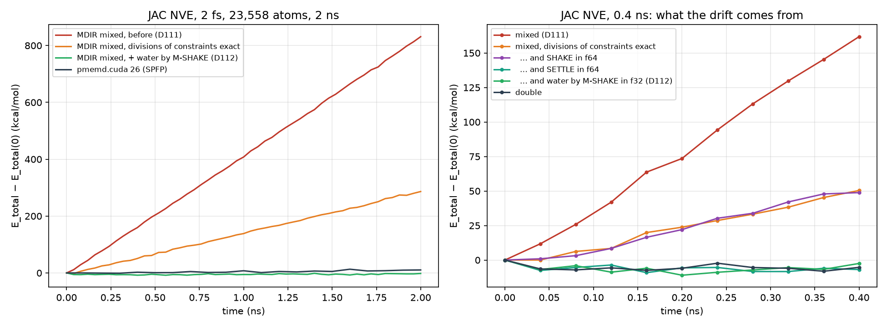

# 7. Precision

MDIR compiles a run in one of three precision modes. The mode assigns a
floating-point type to each *role* of a value, and the compiler converts
values where they cross from one role to another (`md-exec-assign-precision`,
Section 3.4):

*Table 7.1. The types of the roles in each mode.*

| Mode | Positions | Forces | Kernels of terms | Integrators | Global sums |
|---|---|---|---|---|---|
| `single` | f32 | f32 | f32 | f32 | f64 |
| `mixed` | f64 | f32 | f32 | f64 | f64 |
| `double` | f64 | f64 | f64 | f64 | f64 |

The mixed mode is the mode of production. It is shaped by one fact of the
hardware that MDIR targets first: a consumer GPU such as the RTX 3090
executes f64 arithmetic at 1/64 of the rate of f32. Everything that runs
per pair should therefore be f32; everything whose error would accumulate
over the run, the state and the sums, stays f64. This section states what
stays wide and why, what is approximated and within what bound, and how a
drift of the energy that the approximations caused was found and removed.

## 7.1 What stays in f64, and why

**The state.** Positions and velocities are f64, and the loops over
particles that update them (kicks, drifts, the thermostat, the scaling of
the barostat) compute in f64. An f32 position of a particle in a cell of
60 Å is resolved to $4\times 10^{-6}$ Å; a step of 2 fs moves an atom by
about $10^{-2}$ Å, so an f32 state would lose a quarter of the digits of
every displacement to rounding.

**Differences of positions.** A kernel of a term takes a displacement, not
two positions. Where the positions are f64 and the kernel f32, the
difference is the step where precision is lost, so it is taken from wide
values and only then narrowed:

- For the terms over tuples (bonds, angles, dihedrals, 1–4 pairs), a loop
  over particles converts the positions to f32 once per evaluation, and
  the loops read that field (D79). The difference of two f32 positions
  has an absolute error of at most one ulp of the coordinate, $4\times
  10^{-6}$ Å in a 60 Å cell, small against the 0.1 Å scale on which a
  bonded term varies.
- For the loops over groups, the gather adds the integer shift of the
  frame to the position in f64 and converts the sum (D95, D101), so the
  positions of a pair are those of a cell near the origin however far the
  particles have diffused: an f32 position of an unwrapped particle 1000 Å
  from the origin would carry $6\times 10^{-5}$ Å of rounding.
- For the constraints, the displacements of the members are taken in f64
  and converted (D75); in the fused integration kernel each member's
  position is taken relative to that of the first member of its group
  before it is narrowed (D110).

**Sums.** Global sums (energies, virials, the kinetic energy) are
accumulated in f64, in a fixed order, from partial sums in the type of
the kernel over a block. The charges of particle mesh Ewald are spread in
fixed point in the deterministic mode, with 64-bit integers at the scale
$2^{40}$ [[LeGrand2013]](references.md#legrand2013) (D70), whose sum does not depend on the order of
the threads; by default they are added with f32 atomics (D84). On the
CPU every reduction of a parallel loop is added over a fixed number of
chunks of contiguous particles, each in order, and the chunks in their
order (D171): the sum depends on the number of particles
alone, not on the threads or how many there are. Before, the OpenMP
runtime combined the partial sums of the threads in the order in which
they finished; with a thermostat or a barostat, whose coupling reads the
kinetic energy and the virial, two runs with four threads then differed in
up to 1.3e-15 of the positions after 200 steps, and the deterministic mode
did not prevent it.

**What a step of energy may not change.** A step that writes energies
computes more than a plain step, and in the deterministic mode none of it
may change the rounding of the dynamics (D201, D[deterministic-energy-steps]).
Three things did. LLVM fuses a product into a multiply-add only where the
product has one use, so the energies and the virial changed which products
of a force were fused; the device kernels now make every sum with a
product as an operand a fused multiply-add, by the formula alone. The type
in which a field is stored came, for every field stored together with it,
from a buffer of a host call that it reached, so the forces that a loop of
steps carries were f32 where the loop's result reached the buffer of a
checkpoint and f64 where it did not; a buffer now reaches the fields
through a copy. And the kernel that joins the constraints with the loops
over particles around them (D110) narrowed the positions of the members
relative to the first before taking their differences, where a step of
energy, which runs the loops alone, narrows the differences; the joined
kernel now takes the stored positions. With constraints and PME, in mixed
and double precision, on the CPU and a GPU, 20 steps with a row of energies
at every step and with one at the end then give the same state bit for
bit, at the speed of the deterministic mode before (JAC, 0.326 against
0.325 ms per step).

## 7.2 What is approximated, and within what bound

Under `fast_math` (the default of the suite) the f32 kernels of the terms
of the potential take three approximations. Each is a rewrite of the IR
with a stated bound, not a library flag:

1. **Divisions and exponentials** take `afn` (D90). On a device an f32
   division becomes a product with an approximate reciprocal,
   `x * rcp.approx.ftz(y)`, within 1 ulp (D98), and an f32 exponential
   becomes `ex2.approx` of $x\log_2 e$, within $2 + 1.2\lvert x\rvert$
   ulp, about $1.5\times10^{-6}$ relative at $x = -(\beta r_c)^2 \approx
   -10$.
2. **Radial tables** (D94). `md-exec-simplify-distance` writes a pair
   kernel in powers of $r^2$ and groups its terms by the factors that do
   not depend on the distance; a group whose dependence on the distance
   takes more than roots and powers becomes a product of those factors
   and a function $g(r^2)$, outlined into a function in f64. For the
   direct sum of Ewald that is
   $g(s) = f\operatorname{erfc}(\beta\sqrt s)/\sqrt s$ for the energy and
   another such function for the force. In an f32 kernel $g$ becomes a
   table over $s\in[2^{-10} r_c^2, r_c^2]$ (`md-exec-expand-radial`):
   the intervals are named by the bits of $s$ as an f32 number, $2^b$ for
   each power of two, and each holds a cubic in $u = s - s_0$, which is
   exact in f32, in the Newton form through four Chebyshev nodes, fitted
   in f64. The pass takes the fewest bits $b \in [4, 12]$ whose cubics are
   within $3\times 10^{-8}$ of the function in f64, relative to its
   largest value on the interval, and fails unless they are within
   $3\times 10^{-7}$ as a kernel evaluates them in f32 with fused
   multiply–adds, checked at 17 points of every interval. On JAC
   ($r_c = 8$ Å) $b = 7$: 1281 intervals, 20 KB a table, each interval
   read with one load of 16 bytes. In an f64 kernel the function is
   inlined with the exact `math.erfc`. A function that no table holds
   within the tolerance stays in its kernel, in the kernel's type: the
   factor $\exp(\sigma/(r - a\sigma))$ of the Stillinger–Weber form, whose
   cutoff is its pole, vanishes there with all its derivatives and is not
   finite at it (D159).

   **The cutoff in f32.** A kernel in f32 tests $r^2 < r_c^2$ and then
   takes $r = \sqrt{r^2}$, which can round to $r_c$; for such a factor
   that is a division by zero. The square of the cutoff in f32 is
   therefore pulled in until the square root in f32 of every square that
   passes is four units in the last place below $r_c$ in f32, some
   $5\times10^{-7}$ of $r_c$. The four units are a heuristic: they cover a
   product of f32 constants, such as $a\sigma$, that rounds a unit below
   the cutoff, and not constants written to put the pole further inside.

   **Pairs that do not interact.** `md-exec-simplify-distance` writes a
   pair kernel as terms $c\,r^p$, the Lennard-Jones as
   $4\varepsilon\sigma^{12} r^{-12} - 4\varepsilon\sigma^6 r^{-6}$ and its
   force with $r^{-14}$ and $r^{-8}$. In f32, $r^{-14}$ leaves the range
   below $r \approx 1.8\times10^{-3}$ nm, where two particles of an ideal
   gas can come, and a pair of $\varepsilon = 0$ would then give
   $0\cdot\infty$, not a number. A term with an inverse power of $r$ is
   therefore 0 where its factor $c$ is: one comparison and one selection
   a term, 0.7% of the time of a step on JAC (0.2125 against 0.211 ms).
   The sum is then exact for such pairs at any $r > 0$, in every mode.

   **Tables of the control file.** The coefficients of a tabulated
   function of the control file (D138, D165) are stored, like every table
   of a kernel, in the type of the kernel, f32 under `mixed`, and the
   polynomial of a cell is evaluated in it: the coefficients carry a
   relative error of $6\times10^{-8}$, and Horner's rule over the 16 or 64
   of a cell adds some units of the last place. On the dipeptide, terms in
   functions of two and three arguments and a discrete table give forces
   within $6.3\times10^{-6}$ of the largest against OpenMM in f64, with
   the rest of their kernels in f32; in `double` they agree within
   $1.9\times10^{-12}$.
3. **The complementary error function**, where it remains in an f32
   kernel after the tables, as in a pair term written over a tuple set.
   $\operatorname{erfc}(c\sqrt y)$ with a positive constant $c$ is
   rewritten as

   $$
   \operatorname{erfc}(x) \approx e^{-x^2}\, P(t), \qquad t = \frac{1}{1 + x/2},
   $$

   with $P$ of degree 9 fitted by least squares, weighted by
   $1/(\operatorname{erfc}(x)e^{x^2})$, to $\operatorname{erfc}(x)\,e^{x^2}$
   on $[0, 6]$ (`scripts/fit-erfc.py`) and evaluated by Horner's rule with
   fused multiply–adds. Its largest relative error on that interval is
   $1.3\times10^{-8}$ with $P$ in f64 and $3.2\times 10^{-7}$ with $P$ in
   f32 (`test/Integration/erfc-approximation.mlir` checks
   $5\times10^{-7}$); beyond $x = 6$,
   $\operatorname{erfc}(x) < 2.2\times 10^{-17}$. The exponential is the
   one the derivative computes anyway,
   $\frac{d}{dx}\operatorname{erfc}(x) = -\tfrac{2}{\sqrt\pi} e^{-x^2}$:
   the pass reuses an $\exp(ky)$ of the kernel whose $k$ is within 4 ulp of
   $-c^2$, so the approximation costs a polynomial and shares the
   transcendental. The direct sum of Ewald took this form from D90 until
   the tables of D94 replaced it there (the loop over pairs of JAC, 73.1
   to 65.4 µs at a reach of 9 Å).

**Scope** (D112). The approximations apply to the kernels of loops over
pairs and of loops over tuples that are not disjoint, the terms of the
potential, and to nothing else. The integrators and the constraints keep
their arithmetic. Section 7.3 explains why the scope matters.

## 7.3 A drift of the energy, and its removal

**Observation.** Over 2 ns of JAC at constant energy (23,558 atoms, 2 fs,
SHAKE on the bonds of hydrogen and rigid water, mixed precision), the
total energy rose linearly by 830 kcal/mol and the temperature by 7 K
(Figure 7.1). pmemd.cuda (SPFP [[LeGrand2013]](references.md#legrand2013)) on the same input changed
by 10 kcal/mol over the same 2 ns, and MDIR in double precision did not
drift. The neighbor structure (groups or the matrix) and the fusion of the
integration kernel (Section 8.2) made no difference.

**Why random errors heat.** Suppose that a constraint solver returns, at
every step, displacements with an error $\delta\mathbf x_i$ of zero mean,
independent of the velocities and from step to step, with variance
$\sigma_x^2$ per component. Since the velocities take the change of the
positions over the step (the first half of RATTLE [[Andersen1983]](references.md#andersen1983)), each
step adds to the velocities an error $\delta\mathbf v_i = \delta\mathbf
x_i/\Delta t$, and the kinetic energy changes by

$$
\Delta K = \sum_i m_i\, \mathbf v_i\cdot\delta\mathbf v_i +
\tfrac12 \sum_i m_i\, \lVert\delta\mathbf v_i\rVert^2 .
$$

The first term has zero mean; it contributes a random walk that grows as
$\sqrt n$ after $n$ steps. The second is positive at every step, with the
mean

$$
\mathbb E[\Delta K] = \frac{3}{2}\,\frac{\sigma_x^2}{\Delta t^2}\sum_i m_i ,
$$

so the energy grows linearly, at a rate set by the square of the error and
the inverse square of the step. A random error in the constraints acts as
a thermostat at infinite temperature. The same argument, with the
velocity errors of a constraint computed in single precision, is the
mechanism that [[Jung2026]](references.md#jung2026) identifies for the drift of single-precision
M-SHAKE.

Applied to the observation: 286 kcal/mol over $10^6$ steps (the drift that
remained after the first fix below) is $0.120$ amu Ų/ps² a step; with
$\Delta t = 0.002$ ps and the 7023 waters of JAC ($\sum m \approx 1.26\times
10^5$ amu),

$$
\sigma_x = \Delta t\,\sqrt{\frac{2\,\mathbb E[\Delta K]}{3\sum m_i}} \approx 1.6\times 10^{-6}\ \text{Å},
$$

about thirteen units in the last place of a coordinate of 1 Å in f32. An
error of that size can only come from arithmetic on quantities of the size
of the water, not of the step's change.

**Bisection.** Each part of the mixed mode was turned back to f64, or its
approximation off, over 0.4 ns (Figure 7.1, right): kernels in f64 removed
the drift; forces stored in f64 did not; removing `md-exec-approximate`
reduced it from 160 to about 50 kcal/mol; the approximate division alone
accounted for that part; of the kernels, only those of the disjoint tuples
(the constraints) mattered; and of the constraints, SETTLE in f64 removed
the rest, SHAKE in f64 did not.

**Cause 1: approximate inverse masses.** The pass had marked every f32
division of every loop as approximate, including the inverse masses of
the constraint solvers. A constraint correction must be the projection
orthogonal in the metric of the masses; with $1/m_a$ perturbed by an ulp,
the members of a group were weighed otherwise than the kicks weigh them,
and the projection became oblique. The fix restricts the pass to the
terms of the potential (Section 7.2): 830 to 286 kcal/mol over 2 ns.

**Cause 2: SETTLE in f32.** SETTLE [[Miyamoto1992]](references.md#miyamoto1992) solves the three
distances of a rigid water in closed form: it builds a frame from the old
plane of the water, finds three angles, rotates the canonical triangle,
and returns the new positions about the center of mass, from which the
change of the step is the difference. In f32 every quantity in that chain
is of the size of the water, about 1 Å, and the change, about $10^{-2}$
Å, is the difference of two such quantities: its absolute error is a few
ulps of 1 Å, multiplied through the trigonometric reconstruction, which is
the $\sigma_x$ found above.

M-SHAKE [[Krautler2001]](references.md#krautler2001) carries the change itself. Its iterations of
Newton accumulate the displacement of each member as a sum of corrections
$\lambda_l \mathbf s_l / m$, each a small number computed with the
relative precision of f32, so the absolute error of the change is of the
order of $2^{-24}\lVert\Delta\mathbf x\rVert \approx 10^{-9}$ Å
(Section 6.2 derives the iteration). Below double precision MDIR therefore
constrains the water by M-SHAKE on its three distances (two O–H and the
H–H), in f32; double precision keeps SETTLE, which is exact in closed
form. Over 2 ns of JAC the total energy then fell by 5.7 kcal/mol by the
first row of the log at 40 ps, the transient of the first few ps that
Section 13 traces to the input, which pmemd.cuda shows too, and
afterward rose along a fitted line by 1.5 kcal/mol/ns, with rows scattered
by 1.3 kcal/mol about it; pmemd.cuda on the same input rose by 5.9
kcal/mol/ns (scatter 2.1). The rate was that of before, 722 ns/day over
the long run. SETTLE in f64 also conserves the energy, but at 581 ns/day
against 724: the f64 arithmetic of a closed form runs at 1/64 of the rate.

*Figure 7.1. Total energy of JAC NVE. Left: 2 ns, MDIR before D112, after
the fix of the divisions, and after M-SHAKE for water, against
pmemd.cuda. Right: 0.4 ns, each part of the mixed mode in f64.
(`figures/energy-jac.png`, from `scripts/paper/plot-energy.py`.)*

**What it teaches.** A rewrite that is harmless in a term of the potential,
whose error is bounded and smooth, is not harmless in an operator whose
error is divided by the step. The precision policy of MDIR now names the
roles that may be approximated, rather than the types that may be.
