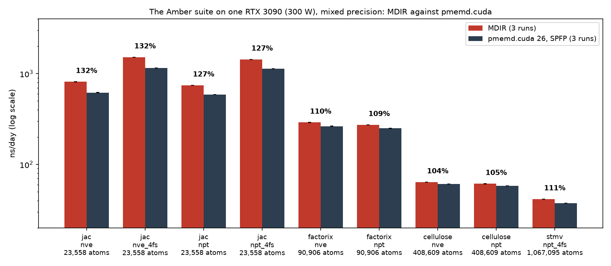

# 10. Performance

## 10.1 Conditions

*Table 10.1. What was measured, and how.*

| Item | MDIR | pmemd.cuda |
|---|---|---|
| Program | `mdir` at D118, built with LLVM and MLIR 23.1.2, PTX compiled by the driver at load | pmemd.cuda of Amber 26, SPFP [[LeGrand2013]](references.md#legrand2013), built with CUDA 13 |
| Device | One NVIDIA RTX 3090 (GPU 0), power capped at 300 W, driver 595.84; the node's other GPUs ran other jobs, among them, during the third repeat of pmemd.cuda, runs of this work on GPU 1 | The same |
| Inputs | The systems of the Amber 24 GPU benchmark suite (PME), the topologies and restart files of the suite as they are (`prmtop`, `inpcrd`; two topologies are in the format before Amber 7, D133), with the settings of `scripts/benchmarks/amber/bench.py` | The inputs of the suite as they are (`mdin.GPU`, `prmtop`, `inpcrd`) |
| Model | Cutoff 8 Å; PME with $\operatorname{erfc}(\beta r_c) = 10^{-6}$ at constant energy and $10^{-5}$ at constant pressure, grid spacing at most 1 Å, order 4; SHAKE on the bonds of hydrogen and rigid water; the correction for the dispersion | The same, by the inputs |
| Couplings (NPT) | Stochastic velocity rescaling [[Bussi2007]](references.md#bussi2007) and stochastic cell rescaling [[Bernetti2020]](references.md#bernetti2020), every 25 steps, $\tau_T$ = 1 ps, $\tau_P$ = 2 ps | Berendsen's thermostat [[Berendsen1984]](references.md#berendsen1984), $\tau$ = 10 ps; Monte Carlo barostat every 100 steps |
| Neighbors | Groups of 16 (Section 4.4); dual list, outer reach 11 Å, inner 8.6 Å at 2 fs and 9.2 Å at 4 fs (Section 4.5) | Its own |
| Precision | Mixed (Table 7.1), `fast_math` | SPFP |
| Steps | JAC 10,000; FactorIX 4000; Cellulose 1000; STMV 500 | Those of `mdin.GPU`: JAC NVE 100,000, FactorIX NVE 20,000, Cellulose NVE 30,000, STMV 2000, … |
| Rate | Over the second half of the run, past the compilation, the set-up, and the first build | Over all steps, as pmemd.cuda reports it; its rate over the steps after the first report differs by at most 0.5% |
| Output | Energies twice; no trajectory | Energies and trajectory every 1000 or 2500 steps, as the inputs ask |

The two programs ran one after the other on the same device, MDIR over
the whole suite and then pmemd.cuda, three times
(`scripts/paper/run-suite-repeats.sh`). The benchmark script watches the
device every two seconds during each run and marks the rate as no
measurement if another process used it; no run of the repeats was
marked. The ratio of a
system is taken within each repeat and then averaged. The table is made
by `scripts/paper/suite-table.py` and the figure by
`scripts/paper/plot-suite.py`.

## 10.2 Rates

*Table 10.2. Rates over the Amber suite, mean ± sample standard deviation
over three repeats. "Energy changed by" is the change of the total
energy (NVE) or of the conserved energy (NPT) between the first and the
last row of MDIR's log, relative to its value. The counts are the mean
number of steps between builds of the outer list and between prunings of
the inner list. The rates, the changes of the energy, the counts, and the
times of compilation are from the same three repeats, at D118.*

| System | Atoms | MDIR, ns/day | pmemd.cuda, ns/day | MDIR / pmemd.cuda | Energy changed by (MDIR) | Builds, prunings: every | Compiled in |
|---|---|---|---|---|---|---|---|
| `jac_nve` | 23,558 | 816.9 ± 0.8 | 621.0 ± 1.2 | 131.5 ± 0.4% | 6.9e-05 to 1.5e-04 | 16.4, 2.8 | 11–12 s |
| `jac_nve_4fs` | 23,558 | 1525.9 ± 2.5 | 1154.6 ± 2.0 | 132.2 ± 0.3% | 3.3e-03 to 3.4e-03 | 10.7, 3.6 | 11–12 s |
| `jac_npt` | 23,558 | 753.8 ± 1.1 | 588.9 ± 1.4 | 128.0 ± 0.1% | 3.6e-04 to 4.1e-04 | 16.2, 2.8 | 21–22 s |
| `jac_npt_4fs` | 23,558 | 1454.3 ± 1.0 | 1137.4 ± 3.6 | 127.9 ± 0.5% | 5.6e-04 to 7.6e-04 | 12.7, 4.1 | 21–22 s |
| `factorix_nve` | 90,906 | 291.6 ± 0.4 | 265.7 ± 0.3 | 109.8 ± 0.1% | 1.8e-06 to 1.9e-05 | 14.8, 2.7 | 11 s |
| `factorix_npt` | 90,906 | 276.5 ± 0.5 | 252.3 ± 0.5 | 109.6 ± 0.0% | 2.7e-04 to 2.8e-04 | 14.8, 2.7 | 22 s |
| `cellulose_nve` | 408,609 | 63.3 ± 0.0 | 61.6 ± 0.1 | 102.7 ± 0.2% | 7.5e-05 to 8.1e-05 | 13.8, 2.2 | 9–10 s |
| `cellulose_npt` | 408,609 | 60.9 ± 0.1 | 58.5 ± 0.0 | 104.0 ± 0.1% | 7.8e-05 to 1.1e-04 | 13.7, 2.2 | 18 s |
| `stmv_npt_4fs` | 1,067,095 | 42.0 ± 0.1 | 37.5 ± 0.2 | 111.8 ± 0.6% | 4.5e-05 to 7.9e-05 | 6.7, 2.1 | 21–22 s |

*Figure 10.1. The rates of Table 10.2 on a logarithmic scale, with the
ratio of the means above each pair.*

MDIR is faster than pmemd.cuda on every system of the suite. The margin
is largest on the smallest system and smallest on Cellulose:

- **JAC** (23,558 atoms; a step of about 210 µs at 2 fs). A step of this
  size has few warps of work per kernel and many kernels, so what the
  host and the launches cost matters as much as the arithmetic. The
  integration kernel (Section 8.2) does in one launch what took three,
  the flags of the tests reach the host without waiting for the stream
  (Section 8.3, from 695 to 739 ns/day, and with mapped memory of the
  host from 771 to 817), and the dual list keeps an
  inner list of reach 8.6 Å, pruned every 2.8 steps, under an outer list
  of 11 Å built every 16, so the loop over pairs reads the pairs within
  8.6 Å rather than within the 10 Å of one list (Section 4.5).
- **Cellulose** (408,609 atoms). The device is busy 97% of a step (Table
  8.2); the loop over pairs and PME take two thirds of it, and both are
  close to the limits of their resources (the loop over groups at 92% of
  the peak of the pipe of loads and shuffles). Here the ratio rests on the
  arithmetic of the kernels: each pair once, tables of the radial
  functions (Section 7.2), the bricks of the spreading (Section 5.3).
- **STMV** at 4 fs (1,067,095 atoms) builds its outer list every 6.7
  steps and prunes every 2.1. Its ratio lies between those of FactorIX
  and Cellulose; the measurements of this paper do not separate its
  causes.

## 10.3 Energy in the measured runs

A rate is reported with the conservation of the run that measured it
(Section 12). The changes in Table 10.2 are over runs of 2 to 40 ps and
include the transient of the start of each restart file (Section 13);
they are not drifts. Over 2 ns, the rate of drift of JAC is 1.5
kcal/mol/ns against 5.9 for pmemd.cuda (Section 9.4).

## 10.4 Compilation

Each run compiles its program first (Section 3.6). The time is that of
the column "Compiled in" of Table 10.2: about 10 s for a system at
constant energy and about 20 s at constant pressure, whose module has
the programs of the barostat in addition, independent of the size of the
system. It is spent once per run: 4% of a run of 2 ns of JAC, which
takes 4 minutes, and 0.1% of a run of 100 ns.

## 10.5 Over long runs

Over 2 ns of JAC at constant energy before the dual list (D112), the rate
fell from 726 to 722 ns/day, most of it in the first 0.5 ns, and then
stayed flat; an earlier build fell by 1.8% in the same way. The loops over
pairs read the particles in the order of the last build (D86) and do not
slow; what slows is the loops that read the state in its own order, which
is sorted only where a run begins (Section 4.2).

## 10.6 Against GROMACS on a protein in OPC

The target of the milestone was the rate of pmemd.cuda; GROMACS 2026.3
[[Pall2020]](references.md#pall2020), built with CUDA and run on the same
device, is the stronger reference on a small system. The system is
ubiquitin (1UBQ) in 5700 OPC waters with amber19sb.ff, 24,031 particles
in a triclinic cell, prepared and equilibrated by GROMACS
(`scripts/validation/protein/run.py`); its energy terms agree with
GROMACS's (Section 9.1). Both run 60,000 steps of 2 fs from the
equilibrated state in mixed precision, timed over the second half, with a
cutoff of 9 Å, PME with $\operatorname{erfc}(\beta r_c) = 10^{-5}$, SHAKE
on the bonds of hydrogen and rigid water, and at constant pressure the
same couplings every 25 steps. MDIR uses groups and the dual list with
reaches of 12 and 9.6 Å, within 0.4% of the best of 11 to 12 Å and 9.4 to
9.8 Å; GROMACS its own list, its nonbonded terms and PME on the GPU, and
its update on the CPU, which virtual sites need.

*Table 10.3. Ubiquitin in OPC, RTX 3090 at 300 W, at D118, mean ± sample
standard deviation over three repeats, each program after the other on
the device, with nothing else on the host. GROMACS at constant energy over
two of them: the third gave 789.6 ns/day, having spent 0.45 s writing its
output against 0.04 s in the other two ("Write traj." of its accounting of
cycles, a stall of the shared file system). "Energy changed by" as in
Table 10.2, over 120 ps, the range of the three. At constant pressure MDIR
counts the work of the barostat from the virial of the groups (D116); with
the count before it, $-228$ kcal/mol/ns (Section 13). The other settings
of GROMACS are from one run each, before D118.*

| Ensemble | MDIR, ns/day | GROMACS, ns/day | MDIR / GROMACS | Energy changed by: MDIR | GROMACS |
|---|---|---|---|---|---|
| NVE | 605.2 ± 0.4 | 842.9 ± 2.9 (nstlist 80; 689.7 with the nstlist of 10 that it keeps at constant energy) | 71.8 ± 0.2% | $2.4\times10^{-5}$ to $4.4\times10^{-5}$ | $1.7\times10^{-4}$ to $2.0\times10^{-4}$ |
| NPT | 571.5 ± 0.7 | 865.5 ± 4.4 (771.8 with `verlet-buffer-tolerance` $5\times10^{-5}$) | 66.0 ± 0.4% | $1.6\times10^{-6}$ to $1.2\times10^{-4}$ | $6.7\times10^{-3}$ to $7.1\times10^{-3}$ |

*Table 10.4. The device time of a step, NVE, from nsys: MDIR over 20,000
steps before D118, GROMACS over the 3528 steps that the profile captured.
MDIR's kernels are sorted by their kind. D118 changed none of them; it
took the time the device stood idle in a step from 49 to 29 µs.*

| Part | MDIR, µs | GROMACS, µs |
|---|---|---|
| Loops over pairs | 91.6 (the inner list of 9.6 Å) | 87.7 (one kernel; a list of 10.7 Å built every 80 steps) |
| PME | 47.3 | 76.7, on a second stream beside the nonbonded kernel |
| Loops over particles: the drift, the kicks, and the other loops over particles | 48.9 | The update on the host |
| Loops over tuples: bonded terms and excluded pairs 22.5, SETTLE 11.8, placement of the sites 4.9 | 39.3 | Bonded terms, SETTLE, and sites on the host; excluded pairs in the nonbonded kernel |
| Builds and prunings of the lists | 34.6 | In the nonbonded kernel, every 80 steps |
| Layout and reductions | | 18.3 |
| On the device | 261.8, one stream | 182.8, two streams |
| Wall time of a step | 310 | 214 |

The loop over pairs costs the same in both programs, and MDIR's PME is
faster. GROMACS runs beside that loop what MDIR runs after it: PME on a
second stream of the device, and the bonded terms, the update, and the
constraints on the 64 threads of the host. MDIR runs every part on one
stream; its loops over particles and over tuples and its builds and
prunings take 123 µs of the device in a step, and the host's time between
its launches 48 µs of the 310. Its own second stream for the reciprocal
sum (D81, D87), tried on this system, gives 597 ns/day against 609
without (D118). On JAC, with three sites per water and a cutoff of 8 Å, the same
structure is 25% faster than pmemd.cuda (Table 10.2); on this system its
rate is 66% to 72% of GROMACS's, and the measurements place the
difference outside the loop over pairs. GROMACS's conserved energy at
constant pressure changed by $5\times10^{-3}$ to $7\times10^{-3}$ at every
tolerance of its buffer that was tried ($5\times10^{-3}$, $5\times10^{-4}$,
and $5\times10^{-5}$ kJ/mol/ps per atom). Its thermostat alone, without
the barostat, moves it by $+370$ to $+610$ kcal/mol/ns (`nsttcouple` 1 or
25, $\tau_T$ 1 or 10 ps, `nstcalcenergy` 1 or 100), against $-70$ for its
total energy at constant energy; that was not investigated further.
